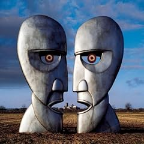

  
So most of you know me. I listen to a wide variety of music... everything from the occasional pop song (ahh, Kelly Clarkson!) to everyday rock to heavy metal. It's all good in my mind.  
  
Well, I was browsing my dad's collection of music the other day, and I pulled out Pink Floyd's "Dark Side of the Moon". Great album. Always have loved it. So I figured, what the hay, let's see what else they have going on.  
  
In 1994, Pink Floyd released their last studio album, entitled "The Division Bell". Most people know Pink Floyd as the "acid rock" band of the late 60's-early 70's. (When I told my dad about this CD, I got a nice story about when he went to see PF in Germany back in '72. It brings my dad into a whole new light...) What a lot of people didn't like about this album was how ... well, different, it was from their old albums. What people didn't realize is that the band had decided to allow their musical tastes to evolve with their age.  
  
I think "The Division Bell" could be classified as rock/funk/soul/blues/jazz/pop all in one. Starting off with a lovely instrumental, transitioning into a funky riff that sounds like it belongs into a porno, before blowing straight into the next song with heavy instruments. Up and down the album goes, back and forth from sweet harmonies on instruments and vocals to screaming lead riffs on guitar.  
  
As a musician and an aspiring guitarist, I definitely appreciate both the musicianship and the simplicity of the album. As layered and complicated as it might seem at first, once you break it down, the entire album is really quite straight-forward and obvious, which is definitely not a bad thing. It's currently the primary album that I'm listening to, alongside Armin van Buuren's "Imagine" (which is techno/trance/house music... so you can see a little bit of my eclectic tastes here...).  
  
Overall: 8/10. I'm similar to a lot of magazines nowadays, where they only give 10's to the \*perfect\* game/CD/device/whatever, and those are even few and far between. If you're a guitarist of any genre, give this album a listen. If you're a broad-spectrumed fan of music, you would definitely enjoy this as well.  
  