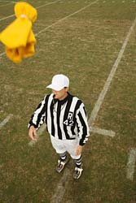

So, this is one of those topics that I am very, very mixed on my stance.  Some of you probably have a steadfast opinion, whereas others are like me and sway back and forth depending on the situation.

I'm talking, of course, about the last-second penalty or foul call.  You know these... the calls within the last few seconds of a game, with a very small score differential, that usually decides the outcome of the game.  Mostly seen in basketball and football, with a small smattering of occurences in hockey, and very rarely in baseball.

For example, I think every NFL fan remembers this call from the beginning of the 2008 season between the Denver Broncos and the San Diego Chargers:

_The play in question occurred with the Broncos at the Chargers 1-yard-line in the final minute. Denver quarterback Jay Cutler dropped back to pass, the ball slipped out of his hands, bounced off the grass and into the arms of San Diego linebacker Tim Dobbins._

_(Referee Ed) Hochuli ruled it an incomplete pass. Replay ruled it a fumble, but it was spotted at the 10-yard line, where the ball hit the ground, and given to Denver because the rules did not permit possession to be awarded to San Diego because the whistle had blown._

_Denver went on to score, convert a 2-point conversion and win 39-38._

Or what about something more recent, during the Feb. 11 game between the Cleveland Cavaliers and the Indiana Pacers:

_With 0.8 seconds left in the game, the score was Indiana 95, Cleveland 93.  Following a Cavs timeout, (Mo) Williams tried to hit (Lebron) James with an alley-oop pass. (Danny) Granger, who had position in front of James, apparently made contact with James as he blocked the pass. James connected on both attempts from the line to knot the contest at 95._

_Ironically, after a Pacers timeout, Granger came off a screen and received the inbound pass on a similar play that netted James his two foul shots. Granger, who was_ _closer to the basket, was fouled when James tried to get back, then hit his first shot from the charity stripe and missed the second on purpose to secure the win._

_"I went back and I watched the last two plays. That last call on Lebron was the worst call that I've ever been a part of," commented Cavs coach Mike Brown. "It was an awful call and for him to take away a basketball game from a team with .04 seconds on the clock is irresponsible. We got the game taken away from us, absolutely horrible. I feel badly for the guys in the locker room._

_"We played well enough to give ourselves an opportunity. That game should have gone into overtime. He determined the outcome. If they want to fine me for telling the truth, then fine me."_

_James also said the last call was one that shouldn't have been made._

_"I thought the one call on Granger against me was questionable," James said. "There was definitely some contact, enough for a whistle to be blown. But it could have gone both ways. The last call against me was not questionable at all. No contact was made. The pass was short. You couldn't go to the rim. There was no way he could catch it and go up with four-tenths of a second. I was able to get a hand on it. Being the competitor I am, to have a game taken away like that, it hurts. It definitely hurts."_

Now, I am all for consistency, for the proper calls to be made, and for things to be called both ways, and not just to benefit the star players.  But I see a major problem when an official determines the outcome of the game, and takes control and destiny away from the athletes on the floor.

Now, I realize that officials and referees are not full-time positions (in most cases), that they do this because they love the game, and so on... but this is still not an excuse.  Make your officials full time, give them training, make this a profession instead of just a job.

Officials, by design, are there to officiate, to referee a game.  In theory, they should stay hidden in the background of the excitement of the play on the field/court.  They play a very key role in determining the pace and style of play of a particular game; can the linemen get away with holding on every single play, or do they need to watch themselves a bit?  Can a center hand-check his opponent as he's being backed down in the paint, or is he required to play straight up?  What about traveling... does anyone ever call anything less than 6 steps anymore?

But all of this determining is done at the \*beginning\* of a basketball/football game.  You test these things out, you find the limits of your particular official, and then you play hard the rest of the game.  There should, under no circumstances, be some form of questionable, ticky-tack call made at a climactic moment that causes momentum to crash to a screeching halt.

Blatent face mask?  Throw the flag.  Hands touching the receiver 5.5 yards after the line of scrimmage?  Ehhhhh...

Hard foul across the arms/chest as a guy goes in for a breakaway layup?  Yep, blow that whistle.  Two battling, aggressive players bumping into each other as they come up the court and establish position (see: Hasheem Thabeet's 4th foul call during UConn's loss to Pitt on Feb. 16)?  My TV is scared of me now, due to me yelling at it for a good 2 or 3 minutes (I apologize, good buddy.  I'll give you a good dusting tonight.) over the ridiculousness of the call.

And the two more in-depth calls I mentioned at the top of the article?  No.  Stinkin'.  Way.  Ed, you've been an official for a long long time; blowing that whistle when you did not only took judgement out of Denver's hands, but also out of yours (since the rules stipulate what you can and cannot do on a reviewed play).  And Mr. NBA Ref, if you're going to call a cheap foul with .8 seconds to go, shame on you... but don't make up for it by calling another cheap foul with .4 seconds left.  That's even worse.

What about you?  Would you rather see consistant calls (as bad as they may be) last through an entire game, or should the refs ease back on the whistle as the clock winds down?
