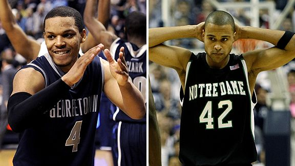

With no news coming out of spring training camps, and Tiger Woods absent from the golf course, what an absolutely fantastic weekend for basketball, both college and NBA.  I think I'm going to need to invest in an additional TV here in the near future if I'm going to keep up with it all.

Over in the NBA today, we already saw the Boston Celtics lose a close one against the Detroit Pistons, and now we're watching a good battle between the injury-plagued Phoenix Suns and the Los Angeles Lakers.  Later this evening, ESPN will have a matchup between the Cleveland LeBrons Cavaliers and the Atlanta Hawks.  Yesterday we saw the Magic edge out the Sixers, as well as Dwayne Wade dominate the Knicks in the 4th quarter, bloody lip and all.

\[caption id="" align="alignright" width="346" caption="(AP Photo)"\]\[/caption\]

For college, we've had #6 Louisville squeaking a great game out from #10 Marquette, we saw #15 Kansas absolutely crush #8 Missouri, and now we've got a great Big Ten battle between #9 Michigan State against #20 Illinois.

Or what about yesterday?  A great game as #2 UConn pulled a win out against Notre Dame.  #12 Villanova goes down to Georgetown, which keeps their Big Dance chances alive.  #25 Florida State upsets #13 Clemson.  Washington State toppling #11 Arizona State on Senior Night.  #24 Texas falling to Oklahoma State.  Or (my personal favorite) Northern Iowa holding on, pulling out a big game at home to clinch the #1 seed and co-champs (with Creighton) in the Missouri Valley.

This college season is shaping up to be absolutely marvelous.  We've obviously got some big name teams (Oklahoma, UConn, Pitt, UNC, etc.) who are making names for themselves as being the dominant teams and early favorites to win it all.  We've got some teams (Georgetown, Notre Dame) that seem to be content wallowing in mediocracy, yet show up at the very end trying to edge their way in to the tournament.  The Big East, ACC, and Big 12 are excellent this season.  The Big 10 and Pac 10 pretend that they're good conferences, but let's face it... they've got a few big name teams, and then the rest of the conferences won't even be considered for the NIT.  Oh, and Andy Katz still hates on the mid-major conferences... but then again, we shouldn't expect anything less.  I mean, George Mason was just a fluke.  Right, Davidson?
