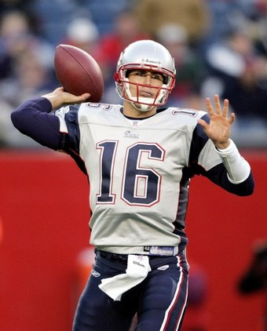
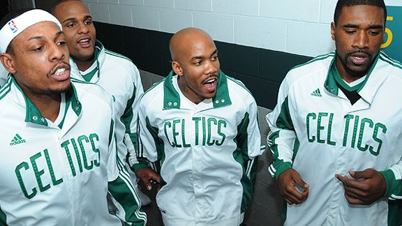

Just thought I'd give an update on all the different big stories that have been going around lately, maybe throw some thoughts in there as well.

**1) Matt Cassel traded to Chiefs (and other NFL updates)**

**There's actually more to this story.  Cassel and LB Mike Vrabel were both traded to the Chiefs in exchange for a 2nd round pick.  Yes, a 2nd round pick.  Are the Patriots really looking at unloading players to get some cap space here?  How on earth did the Chiefs sneak this one under their nose?  Cassel has proven that he's a good quarterback when he's got good targets to throw to.  We'll have to see how well he does down in Kansas City.  (Ironically, Tom Brady got his knee injured in the first game of the season... against the Chiefs.)**

Reportedly there was a proposed 3 team trade including the Broncos shipping out Jay Cutler in order to bring in Cassel.  The vibe from Denver is that Cutler is absolutely furious about this failed deal, so we'll have to see what the Broncos management do in terms of damage control.

Look at the AFC West QBs - Cutler, Cassel, Phillip Rivers, and JaMarcus Russell.  There is a lot of talent at that position this upcoming season.  We'll have to see if the Chiefs and Raiders are able to make some more deals and improve their teams to be even more competitive.

Albert Haynesworth made a big splash as well, signing with the Redskins for $100 million.  It's still really strange to see defensive players signing these huge deals; we're so used to seeing them for QBs and WRs, but the mindset has obviously changed recently.  This still is an absolutely crazy amount of money... [here's a little perspective on it](http://offroute.wordpress.com/2009/02/27/its-just-a-game/).

Brian Dawkins has signed on with the Denver Broncos for 5 years, $17 million.  This will be a great addition for the Broncos, and a huge loss for the Eagles.  We'll have to see what Donovan McNabb's feelings on this trade are, since he's been asking for some new teammates to help him try and end his career on top.

And one last quip: T.J. Houshmandzadeh (I spelled it right without looking, thank you very much) says that he will make his decision on next season on Sunday.  He has recently visited with Seattle and Minnesota, and may visit with the Giants as well.

 

**2) College Basketball - 15 Clemson, 12 Villanova Upset; Duke, UNC, Wake, and UConn Victorious**

'Nova played a close game right down to the end against Georgetown, but unfortunately for them it wasn't enough.  Georgetown kept clawing back in throughout the entire game, getting themselves closer to a potential tournament berth.  Kentucky also lost to LSU today, and with a couple of early season letdowns, they're really close to missing the tournament this season.

Blake Griffin will also be back in the lineup this evening for Oklahoma.  Griffin has been out for a week with a mild concussion, so I'm really hoping to see him bounce back and make a big impact tonight.

**3) NBA Updates - Shaq-tastic Goes for 45, Starbury Signs with Celtics**

Shaquille O'neal dominated the block last night, [scoring over 40 for the first time in 4 seasons](http://sports.espn.go.com/nba/recap?gameId=290227021).  He showed power, hustle (watch the highlight to see him chasing an errant pass), and even had a nice dribble-drive and spin coming in from the corner.  Granted, he was playing the Raptors, but Chris Bosh is no slouch.  I love to see O'neal playing well again, and I hope it keeps up.  Greatest quote of the article: _"I think I'm the only player who looks at each and every center," \[Shaq\] said, "and says to myself, 'That's barbecued chicken down there."_  Shaq, I am going to miss you and your antics when you leave the game... I've followed your career ever since you were with the Magic.  You're a dominating basketball player and a hilarious character, and the game will miss you when you're gone.

If you've read any of my posts before, you understand how I feel about Stephon Marbury.  The Celtics are obviously not employing me as an analyst, as they acquired him yesterday and stuck him straight into the lineup.  He played 13 minutes and scored 8 points, even chipping in 2 assists.  He looked pretty good for a guy who hasn't played in quite a while.  (On a side note... as much as I don't like this guy, I want him to succeed.  The Celtics are banking on Doc Rivers being able to reign in Starbury's personality, and I think Stephon is honestly just happy to be playing basketball again.  Will he be ok with coming off of the bench and becoming a role-player and a defender?  We will see.)

Also, [this is why I love our president](http://sports.espn.go.com/nba/recap?gameId=290227027).

\[caption id="" align="alignright" width="264" caption="Does he prefer Bud Light or Miller Light?"\]\[/caption\]

On a day like today, it's great that we're not hearing anything about Bonds, A-Rod, or any negative things beyond standard injuries.  I'm personally hoping that it continues to stay that way.  Unless something profound happens, I don't really want to hear about it.

Tomorrow has a couple huge NBA games on ABC.  Celtics/Pistons, and Lakers/Suns.  My 2 favorite teams, playing against some good competition... perfect.  It's also the first day of March, which means we're closer to warm weather, the start of the MLB season, and postseason basketball (both NCAA March Madness and the NBA Playoffs).

And by the way... thanks to everyone for stopping by.  Just today, I cracked the 1,000 pageview barrier. :-)
