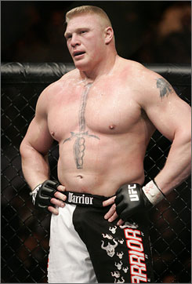

For years, the UFC (Ultimate Fighting Championship) has been lurking around in the shadows, captivating the minds of college students, martial artists, and thrill-seeking enthusiasts, treating us to a bunch of great action and awesome displays of power.  Yet, for some reason, it seems to have slipped under the rugs, only talked about in fleeting conversations by the media.  Where's the love at?

The UFC has existed since 1993, but it wasn't really until 2005 when Spike TV began hosting _The Ultimate Fighter_ that it really began to catch on with the common, everyday people such as you and me.  With boxing twitching in its death throes, the UFC looks now to take over as the "combat" sport of the next generation.  But unfortunately, it still has a lot of tests to pass (Mother's Approval is probably a big "no") before it can truly become mainstream.

In boxing, guys wear big gloves (they're padded, but they still pack a whallop), only punch (or bite... well... sometimes) to the upper body and head, and... well, that's about it.  12 round fights get boring, since from round 6 on, it seems the fighters seem to only be intent on getting in close, leaning on each other, and taking a nap.  Plus (and be honest with yourselves here), when is the last time you watched a live boxing event?  The only time you can anymore is when you catch Pay-Per-View, and who knows how much that costs.

The UFC, on the other hand, is a whole bundle of action and excitement.  3 5-minute rounds (5 rounds for title fights) with full strikes to practically anywhere on the body (yes, there are actually rules in the UFC), completely with a plethora of knock-outs, submissions, chokes, and everything in between mean that most fights have something to offer to everyone.  Oh, and don't forget about the itty bitty gloves that do nothing more than protect knuckles from getting split open.  While the violence factor is obviously present (I've seen a guys arm snapped, and an orbital bone broken by 1 punch), people could've argued that about boxing back when it first became mainstream, and yet people still followed it for decades.  The threshold for acceptable violence in today's media has gone sky high over the past couple of years.

A giant issue with Mixed Martial Arts right now is all the different "leagues" that are out there right now.  While the UFC is obviously the primary event, additional organizations like Strikeforce and the WEC (and many others) have prevented MMA from really exploding onto the big screen.  EliteXC, a now-defunct MMA organization, hosted 3 events in 2008 on CBS, including [the infamous Kimbo Slice vs. Seth Petruzelli fight.](http://en.wikipedia.org/wiki/Elite_Xtreme_Combat#Troubles_and_Failure)

Arguably the biggest name right now in the UFC is Brock Lesnar.  A former WWF/WWE champion and a brief member of the Minnesota Vikings football organization (he was cut from training camp), Lesnar has come roaring back as a MMA fighter and assisted in bringing the sport to the attention of more and more people across the US and the world.  UFC president Dana White initially voiced apprehensions about Lesnar fighting in MMA, stating (something to the general effect of) "making the transition from professional wrestling to professional fighting is a huge step".  However, he has shown both power and speed that no one really expected from him, and after some early success he was given a shot at the UFC Heavyweight Championship.  This caused some controversy within the organization, as he was only 2-1 at the time, but I can personally understand this as a pure publicity move by White and the UFC.  Lesnar went on to defeat Randy Couture on Oct. 15 at UFC 91 and claim the Heavyweight Title.  He will defend this title on May 23 at UFC 98 against Frank Mir, the man to whom Lesnar lost to in his first bout in the UFC.

While the UFC suffers from two of the key downfalls that led to the collapse of boxing (Pay-Per-View only events, high level of violence), they have benefited a great deal from their partnership with Spike TV.  Spike routinely hosts UFC Unleashed, which are reruns of past matches and/or events, as well as the previously-mentioned show _The Ultimate Fighter_.  Occasionally, the UFC will televise a complete live event on Spike free of charge to the viewer, and the two of these I have seen have seemed to be great successes.

I do appreciate that ESPN has taken steps to at least discuss mixed martial arts and the UFC (thought the Kimbo Slice fiasco definitely threw a negative light on the whole thing).  While I don't ever see this becoming something we ever get frequent free events of, I do think (and hope) that this organization has the financial backing and the fan following to carry on for a long, long time.

And hey... if they outlaw fighting in hockey, maybe we could send some of the enforcers over here and see how they fare against guys their own size.
