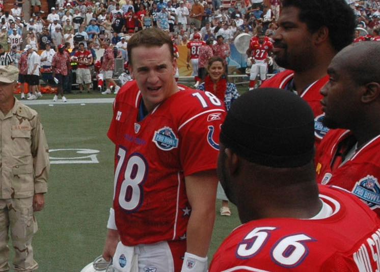

Professional sports are businesses.  I get that.  Players change organizations and uniforms all the time, and that's just part of it.  But with Jay Cutler being shopped around, with Shaq vs. the Magic and Chauncy Billups vs. the Pistons this evening, and with the draft incoming for your favorite college players, I thought I'd bring this topic up.  (Also, because ESPN has this as their current interactive poll.)

Right now, they're asking who would seem the weirdest playing against their "known" team.  Examples given were Kobe, LeBron, Peyton Manning, Tom Brady, or Manny Ramirez.  Well, let's face it... Manny's already gone, and the majority of Red Sox Nation thinks he's a despicable piece of junk.  But what about the others?

Right now, the major talk in the NBA is 2010, when everyone, their mother, and possibly a steroid wielding cousin friends will be eligible for free agency in the NBA.  The big thought is LeBron and another star (Wade, Bosh, etc.) getting signed by the New York Knicks, in an attempt to bring them back into the franchise of power that they once... well, tried to be.  Sorry, Knicks fans, but the Celtics are the powerhouse of the New England area.

Then there's the NFL.  Peyton and Brady are basically \*the\* franchise for their respective teams, and them going anywhere would be absolutely crazy.  But, with the economy as it is, could it happen?  Possibly.  Check out this picture...

Yes, I realize that this is the Pro Bowl... but picture Peyton Manning in Cardinal red.  Or maybe Viking purple.  What if Brady gets injured so badly it ends his career, and the Patriots sign Manning to take over?

Or what about Johnny Damon, the "sweetest ass in Boston" (thanks, Fever Pitch), going from one of the misfits of the Red Sox to the clean cut (and still equipped with a crappy arm) Yankee?  Or go waaaaaay back in the day, before any of us were around, to Babe Ruth.

Is it ethical for a star athlete to go to another franchise, or more specifically, a rival/division opponent?  I think a vast majority of athletes have proven that they don't give a rats hindquarters about who they play for, so long as they're getting paid.  But what about us, the fans that have stood by the organizations through thick and thin?  Jason Varitek as a free agent?  Oh man, it made my stomach churn.  What about Matt Birk (Vikings center) possibly going to the Ravens?  TJ Houshmandzadeah as a Seahawk?

Tell me, sports fans... what's the one athlete that either has, or could potentially, go to a rival/different team that has made your eyeballs cross all on their own?
