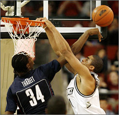

I'm sitting here right now, watching the end of the Cavaliers/Celtics basketball game, and a question drifted into my mind.

What is the single greatest type of play in all of sports?

Now, I'm not talking about a specific play from the past, or a whole thing like the World Series or something.  I'm talking about a specific moment that can happen in any game.  A big dunk in basketball, a huge sack in football, a great knockout in boxing/UFC, or a diving catch in baseball, for example.

I have a couple different ideas of things that could work for this:

- A triple play in baseball.  These are so rare, if you manage to catch one live either on TV or at the game, you'll remember it for a long, long time.  However, I don't like this option, because immediately after the triple play, you have about 5 minutes of downtime.  It's just so anti-climactic.
- A goal in soccer.  I love watching the UEFA Cup when it's on ESPN2, and it's always extremely exciting to see a great goal scored.  The goal is usually magnificent, the crowd erupts, and the players (rightfully) celebrate.  And when most games end 1-0, 2-0, or something like that, every goal is important.  However, this is another case of a downtime killing things.  A goal gets scored, then we sit around waiting to reset and for another 20 minutes of guys kicking a ball around.  So I don't know... I don't think I can give this my vote.
- This can, however.  This is actually what made me start writing this post.  Leon Powe made a huge block for the Celtics in the 4th quarter, and the crowd erupted.  But the play wasn't over yet... the Celtics brought the ball up the court, passed it around, and nailed a 3 pointer to help solidify their win over the Cavaliers.  Sometimes, yes, these blocks are huge, but they go out of bounds and stall play for a bit... but even then, seeing a guy jump above the rim and stop an offense in its tracks makes just about anyone stop and say "whoh".

So what about you?  What's your favorite play to see happen in sports, and why?
