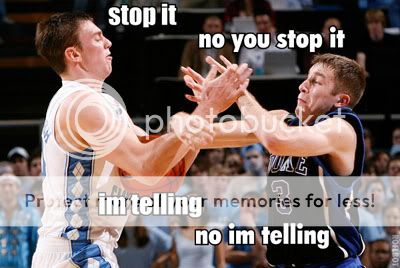

[ESPN reported that](http://sports.espn.go.com/nfl/draft09/news/story?id=4067162) Greg Paulus, point guard for the Duke Blue Devils **basketball team**, worked out for the Green Pay Packers, a **football team**.

My head hurts.

Apparently, Paulus, 6-foot-1, 180 pounds, was a four-time all-state football player; a starter in the U.S. Army All-American game; and set six state passing records. Christian Brothers was 42-3 during his time there, and he had 11,763 career passing yards and 152 touchdown passes in 45 games.  His brother Mike is currently a quarterback at North Carolina (irony?), with Greg being the only of six male siblings to choose basketball over football.

I guess when you're a relative runt, you have to excel at something, right?  (I say this from my 5-foot-7 stature.)

The other odd thing about this was the following...

> A University of Michigan official also confirmed to ESPN.com's Ivan Maisel that Paulus visited the Ann Arbor campus on Tuesday.  FoxSports.com reported that Paulus was there to speak to football coach Rich Rodriguez about the possibility of playing this season for the Wolverines.  He reportedly watched Michigan practice Tuesday afternoon and could fit in with Rodriguez's spread offense.

Um... has the NCAA ever dealt with a situation like this?  Could a guy transfer schools and get an extra year of eligibility for athletics because scouts don't think he could succeed at his current chosen profession?

Don't get me wrong... Greg Paulus is an outstanding college point guard.  But a pro?  I think he would get eaten alive.  And football?  He would have to put on a ton of weight this offseason in order to even have a chance at succeeding.

I have a friendly rivalry with one of my friends at my university.  I'm not particularly a fan of either Duke or UNC, but he enjoys Duke, so I always root for UNC.  Funny how being an antagonist in picking teams has lead me to a handful of my favorites (Red Sox, Cubs, UNC, Vikings... yeesh).  But now, if this comes to fruition and he ends off suiting up for either Michigan or Green Bay, I'll be booing this kid for real.

Oh well.  Tyler Hansbrough is absolutely nothing compared to the Vikings' Jared Allen, or either member of the Williams Wall.

And at least Paulus wouldn't play for the Bears... eh?  Eh?
