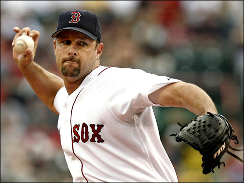

There are some crazy weird things happening this season in the world of sports, and tonight was no different.

• Ichiro hit a grand slam tonight.  While his swing is nowhere near as smooth and sweet as Griffey's (I'm really going to miss him when he's gone from this sport), no one really considers Suzuki to be a power guy, yet he went down and got a ball, carving a beautiful rainbow into about the 5th row.

• Orlando Hudson hit for the cycle on Monday, the first time in 70 years for a Dodger.  Ian Kinsler decided to do him one (or actually, 2) better.  Check out his hits on Wednesday night:

First pitch double 3rd pitch HR First pitch single 3rd pitch single 6th pitch triple (by the way, I'm only in the 6th inning right now) 2nd pitch double in the 8th

Kinsler is the first person to go 6 for 6 with a cycle in over 100 years.  Wicked cool.

• Tim Wakefield... normally when I talk about him, it's got to do with 3 things: age, his "fastball", or him getting shelled.  Tonight, Wakefield impressed us all, taking a no-hitter into the 8th inning, and ended off finishing off a complete game.  With the Red Sox struggling early, and a few starters moving onto the DL (I swear, if my Fantasy team gets any more hurt, I'm going to get really frustrated), Tim delivered exactly what the Red Sox needed, with a win and a bullpen-preserving game.  Also, it looks like George Kottaras is going to be Wakefield's catcher this season.  While I didn't get to see his defensive stats (aka passed balls), I'm assuming that he did ok (simply due to the fact that they showed none of him on Sportscenter), and he also went 1-3 with a walk.

• Rachel Robinson, also known as Mrs. Jackie (or as she always called him, "Jack") Robinson, was in the booth during the Mets/Padres game on ESPN.  A Sportscenter anchor put it best: "That lady is a class act."  I loved listening to her talk about her late husband, about the state of baseball, and even interjecting a little live commentary into her time with the men in the booth.  I've resolved as of this evening to learn more about the history of baseball and the former stars (yes, even the Yankees).  Things like the passing of Kidrych and having Jackie Robinson day really make me pine for the old days of Mayes, Ruth, Robinson, Yogi, and the entire vanguard that came before the current era.  Sports have such a rich history to them (especially the primary sports in the US, those being baseball, basketball, and football), that not knowing about it is just a shame.

• Not News: Isiah Thomas is a head coach again.  News: For Florida International.  [Fark](http://www.fark.com): He's giving his first year's salary back to the school.  o.O  This doesn't sound like the Isiah Thomas that we've come to know and question in recent years.  But you know what?  I'm ok with that.

\[caption id="" align="alignright" width="194" caption="Really?"\] \[/caption\]

• Bruce Pearl?  Your rapping skills need work, and your wardrobe reminds me of orange sherbet.  I shudder at the thought of you ever leaving the University of Tennessee and going somewhere else... like, Iowa (could you imagine a gold suit?), Notre Dame (how about green with gold piping?), East Carolina (seriously, the purple would be the worst), or even Hawai'i (does their basketball team still go by the Rainbows?).  Rick Patino pulls off the white suit very well, because... well, because he kinda looks like a mobster.  You, on the other hand, have the mannerisms of a college athlete dressing on one of those gaudy suits as a joke.  Doesn't your wife ever give you a look of complete horror when you walk out the door before a game?  That should be a clue...
