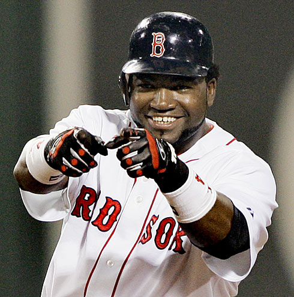

Last season, the biggest worry for the Red Sox was Jason Varitek's struggles at the plate.  This season, our biggest worry has been David Ortiz and his slump.  We've also had injury concerns, with Lowell, Lowrie, and Youk getting injured. And, oh yeah, we got rid of that Ramirez guy.

Tonight's Blue Jays/Red Sox game should alleviate most of our fears.

(Through 5 innings) Varitek has cranked out 2 solo HRs, bringing his count to 7 on the season.  Youk is 2-3, scoring a run and striking out once.  Lowell is 1-3 with an RBI and a K.

And that 0-for-Ortiz guy?  He hit a bomb out to centerfield in the 5th, bringing Pedroia home as well.  One HR isn't much, and maybe he just got lucky, but we can all hope that this is the beginning of the end of his slump.

What about losing Manny? Who's Manny? You mean that guy that took **WOMEN'S FERTILITY DRUGS**? Forget him... Jason Bay is in town. Better teammate, better defensive player, hustles more... oh, and he can hit. Over the Monster wall tonight... epic shot.

\*\*EDIT\*\* The Ortiz HR was \*not\* a fluke. His stroke was absolutely perfect. Obviously he got a good pitch to hit, but before, he would've exploded early and topped it to first. Let's hope this form is here to stay.
