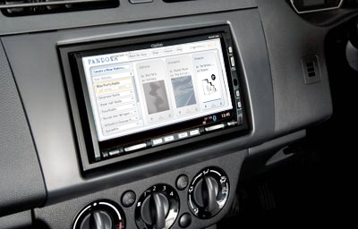

This is something that needs to be made, like, right now.

Don't freak out, this hasn't actually happened yet... I just did a quick mock-up.

Seriously, though, we have all the technology in the world... how has something like Pandora Auto not been created yet?  We could utilize the slowly-dying XM Satellite Radio stuff to broadcast it to anyone who used it.

Or even better... Pandora Portable.  Set it up on a smartphone-esque device, complete with screen and keyboard, and allow people to utilize the service anywhere they go.  It's such a genius idea.

While the major record labels may not be too thrilled with this, a service like this would be a huge boost to the music industry.  I could see people purchasing the device, sort of like a new-school Walkman (for maybe $100?  $150?)... heck, maybe even paying a cheap monthly subscription of $5 or $10.  Enter in the song/band/genre that you enjoy, and let Pandora and the Music Genome Project go to work for you, anywhere you are.

Actually, now that I'm this far along... do something similar to what XM Radio did... have a unit that you can drop into your car, which gets powered/charged and plays through your car speakers, then you can pop it out when you get to the gym or are walking to class or whatever the case may be.  It's brilliant!

Your thoughts?
