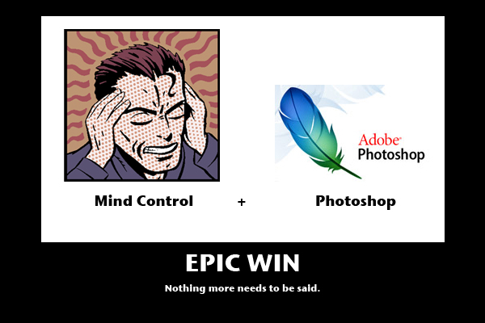

I was working on an image for [my sports blog](http://wordstoplayby.wordpress.com) tonight, and I realized the most amazing thing that needs to be invented, as of yesterday.

Ladies and gentlemen... Photoshop MCE (Mind Control Edition).  Seriously.  Have you ever played with Photoshop for more than an hour?  There are times where I can picture exactly what I want to do, but I can sit for hours upon hours, do things about 20 different ways, and not get the result I want.  Rawrgityblargh.
