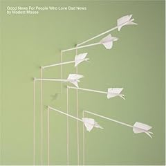

Today has been a very interesting day.

It's Friday, I didn't have to work today, and my allergies were kicking in pretty hardcore yesterday, so I figured I'd sleep in today.  I set my alarm for 10, and I even went to bed at 3-4ish (for whatever reason).  Alas, I arise at 8:30 am.

I spent pretty much the whole morning working on learning some Java code, as well as playing around with some new apps and visual configuration on my Mac.  The app stuff was cool.  The code... eh.  As I slowly progressed through Java, I talked with my friend Allyn about how all this stuff works and some other pointers, I realized that I remembered a lot of my old C code.  I then proceeded to go back through my C final from my first semester of Computer Science classes and refresh my memory.  All 5,791 lines of the program.  That, plus the Java I'd been doing, plus some other coding/scripting I had been doing for some of the applications I downloaded, resulted in a massive headache due to sensory overload.

An easy workout, bike ride, and shower helped to ease some of my pain.  However, I then decided it would be good to label some of the random CDs that I had sitting around.  So, of course, I pull out a Sharpie.  Problem is, this particular Sharpie has been capped for the better part of 2 or 3 years, and the fumes have accumulated inside the cap... so when I take it off, I get a big huff of marker fumes.  Headache returns.

And then, to cap it all off, I attempt to re-install Ubuntu on my HP laptop, using a flash drive.  From a Mac.  There's very little documentation on this, and all my attempts (4 hours worth) failed.  More headache.  I finally give in, go home, and get some blank CDs in order to do this.  Problem solved.  Headache still around.

Tomorrow... working the produce section at Hy-Vee, disc golf, and opening night of Waterloo Bucks baseball.

Listening to: [Good News for People Who Love Bad News](http://www.amazon.com/Good-News-People-Who-Love/dp/B0001M7P78/ref=sr_1_1?ie=UTF8&s=music&qid=1243653565&sr=8-1) - Modest Mouse
