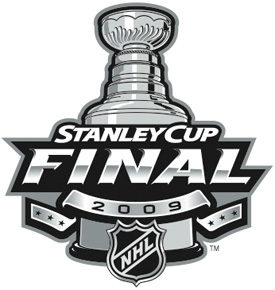

I feel like a terrible sports fan.

Ok, not really.. but I feel like a terrible sports fan + blogger.  I haven't written about anything since Game 2 of the Lakers/Nuggets series.  In fairness, I've been busy with a new job... the only reason I'm able to write today is due to a nasty fever.  (In related news, I'm stuck watching NASCAR on FOX because I'm too tired to reach my remote.)

Since my job has me working evening hours, it's been kinda rough trying to catch a lot of the playoff games that are going on right now.  Obviously, the Magic closed out last night against the Cavaliers.  All of the game I caught, it was basically people waiting for LeBron to make a move.  No one really fought for this series.  Sure, they played hard, but it almost seemed that that the Cavs truly did not have any drive and motivation left in the tank.  Maybe they took a little too much time off after winning 8 straight.  Maybe they were having too much fun with their arcing trick shots.

Lakers/Nuggets = great series.  Obviously not as epic as the Celtics/Bulls series from the first round, but great nonetheless.  Who honestly would've thought at the beginning of the season, or even at the beginning of the series, that Chauncey, Carmelo, Birdman, and company would've put up such a strong resistance to arguably the best overall team in the NBA.  I guess when it was all said and done, it took the entire Lakers team showing up to put the Nuggets away.

Gee... isn't that what team sports are all about?

So now we have the Lakers vs. the Magic.  A true David vs. Goliath matchup (odd that we're not considering Dwight Howard as Goliath in this particular metaphor).  Honestly... I'm not giving the Magic a chance in this series.  I'm sure they might be able to win a game in Orlando, but right now, the Lakers have the team play clicking, and they're prepared to do whatever it takes to help Kobe win his first title sans Shaq.  Add to that the fact that the Magic are a straight-up jump shooting team, and I believe that their legs are going to give out on them in this series... these guys are going to turn into a 1-man show with Dwight Howard, and he isn't going to be enough to get them over the top.

And I'm sorry, David Stern.  Your league may be chock full of stars, but not having a Cavs/Lakers final is going to hurt ratings.  To be honest, as long as the Cavs won the East, anyone in the West would've made an outstanding opponent.  LeBron/Kobe as the new leaders of the NBA.  LeBron/Carmelo as the first true matchup since they were drafted together.  If they'd made it, LeBron/Duncan, a slight changing of the guard, total old school vs. total new school.  Howard/Kobe?  That's like me challenging a sumo wrestler to a foot race.

Also, for all you fans of Pardon the Interruption... Over/Under 2.5 injuries as a result of Howard's elbows this series?

So, since someone has to bring up the topic... 2010.  Free agency.  Actually, why even wait that long?  2009 has the potential to be a rough offseason for a lot of teams as well.

Select unrestricted free agents after 2009 season: Kobe Bryant, Carlos Boozer, Allen Iverson, Ron Artest, Jason Kidd, Shawn Marion, Andre Miller, Lamar Odom and Rasheed Wallace.  Boozer, AI, Artest, Marion, Miller, and Wallace all have a strong potential to end up on a new team next season.  Bryant, Kidd, and Odom aren't going anywhere.

Select unrestricted free agents after 2010 season: LeBron James, Dwyane Wade, Chris Bosh, Amare Stoudemire, Paul Pierce, Ray Allen, Tyson Chandler, Manu Ginobili, Richard Jefferson, Joe Johnson, Tracy McGrady, Yao Ming, Steve Nash, Dirk Nowitzki and Michael Redd.  That list is massive.  Star power everywhere.  We're going to see a lot of shakeups in the next two offseasons, as well as some very interesting drafts.  I expect to see some unexpected teams (i.e. Warriors, Clippers, Bucks, Raptors, and so on) in the playoffs, and wouldn't be shocked to see at least one of them in their respective conference finals.  (To see the full list of restricted/unrestricted free agents over the next two years, [click here](http://sports.espn.go.com/nba/news/story?page=freeagents-09-10))

Hockey is getting their dream wish right now.  Everyone was talking about the Penguins and Capitals series, wishing that we could have that for the Stanley Cup Finals.  Instead, we get Penguins and Red Wings.  There's tons of history with both of those franchises, as well as a slight changing of the guard.  I remember watching hockey "back in the day", and the series then would be Detroit vs. Colorado.  I can't name any of the players from then, but Red Wings and Avalanche was \*the series\*.

It's a shame, then, that NBC basically told the NHL to schedule the playoffs around the premier of Conan O'brien's debut on the Late Show.  Obviously, Conan is hilarious, and in the world of late night television and comedy in general, this is a Big Deal(tm).  But really, back to back playoff games this weekend in order to keep Monday clear?  Seems a bit rough and unfair to me.  Kinda reminds me of the whole Nuggets/WWE fiasco, except this time, sports loses and entertainment prevails.

Tonight is Game 2 of the series.  The Penguins need a strong showing this evening if they have any hopes of competing during this series.  I completely agree with Barry Melrose in his assessment, that being the Red Wings win in 6 games.  The Penguins are young and have a lot of time to mature and win... but the veteran and crafty leadership of Detroit is going to make the difference in this series.  I look for Malkin to have an outstanding game tonight and pull out this victory for Pittsburgh, though.

The big talk in baseball right now is the All-Star game and Manny Ramirez.  For those that don't know, Manny comes off of his suspension for taking **WOMEN'S FERTILITY DRUGS** on July 2.  All-Star Voting ends July 3.  Under the rules of the league and the collective bargaining agreement, if a player is voted in or selected in (by the fans or the managers), there is absolutely nothing the league office can do about it.

What impresses me right now is the Cleveland Indians.  Think about it... they're 22-30 on the season, 7.5 games back of Detroit... but they've already played the majority of their games against the AL East. 1 game against the Yanks, 3 @ the Blue Jays, and then 3 @ the Red Sox to finish the season (plus a home and away series against Baltimore) is all they have left.  Really, for an AL team with playoff aspirations, you can't ask for much more than that.  Do I think they have much of a shot as a postseason team?  Probably not.  But there's always the spoiler role that someone is pretty much required to play.  And who knows... after the run that Tampa made last season, anything is possible.

Also, as hard as I tried, I pretty much gave up on Fantasy Baseball.  My team has remained stagnant for a few weeks, maintaining 6th place overall (out of 10).  My pitching staff just gets hit around too much, and my hitters strike out waaaay too much.  Most weekly matchups are close (decided by 1-3 stat categories), but that's just not going to cut it in the long run.

Also... this short paragraph is the most I'm going to give to the NFL right now.  Otherwise, I'd yell about Brett Favre too much.  Go retire for good, sir.

What about you?  What have sports shown you recently?
