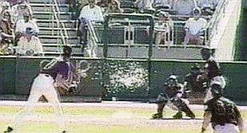

Randy Johnson became the 24th member of the 300 wins club this evening, winning 5-1 against the Nationals tonight.  In doing so, he became the 6th lefty, the 2nd oldest, and the only pitcher to ever defeat all 30 MLB clubs during his quest for 300.  Even at Johnson's spry age of 45, he was still able to knock a ball down, follow it, and make a diving throw to first to prevent a runner getting on base during the game this evening.

There's truly only one image that can sum up Johnson's career, and that's this image from March of 2001:

That's right, the most epic pitch ever thrown.  Johnson struck out 8 and killed 1 (dove) in his last spring training start in '01 with the Diamondbacks.

Truth be told, I learned about Johnson at a very young age when there was a special on him in an issue of Sports Illustrated for Kids.  I don't remember much, but I do remember 2 key things:  1) He enjoys pancakes, and 2) he plays drums prior to games to stay loose.  This seemed extra cool to me, since I've always been a big sports fan and I'm a percussionist myself.

Johnson is, realistically, the last pitcher that will ever achieve 300 wins.  A few pitchers (Sabbathia and Santana, to name a few) are close, but they would have to have a very long and very successful career in order to even have a chance.  I honestly don't see this happening, at least not in this era of the 5 man rotation.  Players have been brought up since high school within the mentality that they'll pitch once a week, or at most, once every 5 days.

Look at some of Johnson's stats:

W-L: 300-164 Career ERA: 3.29 Career Strikeouts: 4,845 5 Cy Young awards 10 All-Star selections 2001 World Series Champ and Co-MVP (w/ Curt Schilling) Threw a no-hitter in 1990, and a perfect game in 2004. Led his league in ERA 4 times and strikeouts 9 times.

This guy is a unanimous 1st ballot Hall of Famer, in my opinion.  Hopefully the voters don't act stupid when the time comes, and give Mr. Johnson the respect he deserves.
