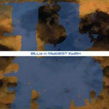

So I'm 3 days into my first summer class... it's quite interesting.  I'm taking Sociology with Sandstrom.  2 hours just seems to absolutely fly by, which is nice.  I've learned quite a bit of stuff even after 3 days, which is also quite refreshing.  Today was humorous... sociology basically turned into Dating 101.  Slightly awkward when a student throws out a "that's what she said" and the professor laughs along with everyone else.

Having the whole apartment to myself is incredible.  I'm able to do whatever I want, whenever I want.  I've moved my TV, PS3, guitar rig, and Griffon (my Ubuntu laptop) into the living room, so I have 2 whole couches to take up instead of just an office chair.  Really upsetting to know that I've only got this for a few more weeks, since at least 1 roommate is coming back in July... well, and then the fact that I move into Shull with a roommate in August.  Ugh.

I'm probably going to have to find a new job (or at least a new department within Hy-Vee).  Handling fresh produce apparently sets off my allergies pretty hardcore.  Even wearing gloves yesterday, it was still bothering me quite a bit.  Otherwise, my cold/flu/bad allergy crap is all gone and out of my system.

It's really really sweet having my guitar equipment back where I can play it wherever I want.  I haven't sat down and actually tried to learn any songs for quite a while (or at least, not on my electric guitar... and any real guitarist will tell you there's a huge difference to playing something on an acoustic vs. an electric), so I've allocated time to do so this past week.  Jammed to some Zeppelin and Pink Floyd the other day, revisited my high school days by playing some Billy Music today, as well as some Cage 9.  My hands are a lot stronger after about 2 months of solid acoustic playing, though, so that's always a plus.

I'm really tempted to turn Griffon into my primary computer.  Right now Phoenix (my Mac) has that honor, but it has absolutely 0 battery time (ok, more like 45 minutes... but still) and sits on my desk attached to an external monitor all the time.  I'm obviously a huge Apple guy, but they have taken some absolutely huge strides in terms of both hardware and software since summer 2005 (when I got my PowerBook G4).  New operating system utilizing 64-bit processing coming out in September.  Dual-core Intel standard in every computer.  I'm still running on a single-core 1.5gHz processor... sloooooooooooooooooow.  Ok, to be honest, it's really not that terrible... but  there's a ton of stuff I can't do without the upgrade, and frankly, I don't have that kind of money right now.  Maybe my parents will be nice and help me out with a super nice early Christmas present... \*wink wink\*  So anyway... having e-mail, instant messaging, Twitter, class notes, coding projects, and music on 2 computers is nice in case something crashes/dies, but I really have to pick just one machine and stick with it... it's honestly a tough choice.  (I'm not even considering my Windoz machine... I only had that for World of Warcraft, and I haven't touched that in months.)

On a side note... 10,000+ songs, 42+ GB of music now.  Under 1,000 songs that I haven't listened to at least once.  That shall be remedied before the summer is out.

I need a new hat.  I haven't gotten one in a while.  I've been looking for a plain black Castro hat for a while... anyone know where I can get one (not eBay)?

Red Sox are 7-0 against the Yankees this season.  One more game this evening, Penny against Sabbathia.  Hopefully Penny pitches lights-out tonight for 3 reasons... 1) a Sox win, to make them 8-0 against the Skankees, 2) a Yankees loss, which is a plus any day of the week, and 3) improving Penny's trade value, since he seems to be one of the big names on the trade block right now along with Masterson.  While I don't want to see anyone go, Theo and Francona know what they're doing.

Real Madrid has spent (I believe the total is) $226 million to acquire Ronaldo and Kaka the past 3 days.  Absolutely insane.  RM has always been a good team, but takes a back seat to Barcelona routinely, but with these two up on their front line in 2010, I wouldn't be surprised to see them make a strong push at the UEFA Cup.

Today seems like a great day for disc golf.  Doug's here, so I think we're gonna go.

/end

Currently listening to: [Midewest Index](http://www.amazon.com/Midwest-Index-Billy-Music/dp/B000063S16/ref=sr_1_3?ie=UTF8&s=music&qid=1244754175&sr=8-3) - Billy Music
