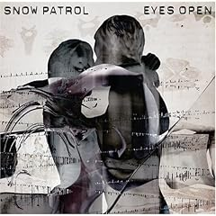

Back in May, I [wrote about a lot of stress I was dealing with](http://niclake13.wordpress.com/2009/05/14/random-thoughts/).  One paragraph in particular sticks out...

> Don’t ever, EVER, question my friendship and my dedication, nor my motivation. I can talk to you, I can be your friend, I can hang out with you, and I’m not going to ask for anything more than that. Respect me? I’ll treat you with respect. **Disrespect me? Well, I’ll keep respecting you anyway. Disrespect my friends? That’s when I get angry.**

I lied.  Disrespect me too many times, and my respect will dsappear.  Disrespect my friends just once?  I get kinda pissed.

Oh, and you gotta take my friends into account on this one... disrespect one of us, and the rest of us will gang up on you.  Forever.

Makes me smile a little bit.

Currently listening to: [Eyes Open](http://www.amazon.com/Eyes-Open-Snow-Patrol/dp/B000F3UADO/ref=sr_1_3?ie=UTF8&s=music&qid=1245001587&sr=8-3) - Snow Patrol
