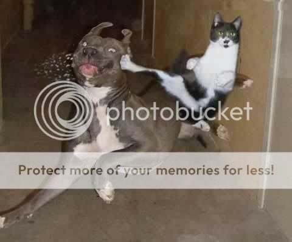

Living as a modern day ninja is quite difficult.

Back in the old days, life was simple.  Kill or be killed.  Honor and responsibility.  A beautiful death.  Nowadays, we've got so much technology, so many things distracting us, that the ways of old have just washed up and died.  Recently, I have taken up the torch, and enlisted in the way of the ninja.  Last night was my first bad experience...

I was sneaking through the target's house.  All the lights were off, the only illumination provided by the glow of the television playing the MLB All-Star Game.  I had on the stereotypical modern ninja suit (what is a modern ninja suit, you ask?  I can't tell you... or else I'd have to kill you), I had my blade which hadn't been sharpened in a few months, and my target was in sight.  I crept along with the agility of a rhinoceros, my foot thundering upon the floor with every step.  I cursed loudly as my cell phone rang in my pocket, but the target didn't stir.  Not only a chicken, but dead to the world as well... perfect.

... ok, so my stealth skills need a little work, but hey, when preparing to make dinner, it's not like perfection is really necessary.  And of course the target couldn't hear me... frozen poultry isn't exactly my idea of a challenging kill.  And yet... it all went completely wrong.

Doug suggests that I need to dress more like Batman, considering the injury and mortality rates of modern-day ninjas.  Apparently he knows something that I didn't, because my graceful stalking was extremely unsuccessful on this night.  Apparently the chicken had been working together with my roommates, and had inside info that I was coming for him.  A giant water jug had conveniently been left in the middle of the floor, just waiting for me to enter.  And it was great protection too.  As I drew my blade back to strike, my foot connected with the jug, and I tripped.

To be fair, it was probably the most graceful trip of my life.  Tripped on the jug, fell over the roof, swung down on a clothes line into the adjacent building, took the elevator back to the top, and ninja-leaped back into my kitchen.  However, somewhere along the line, my steak knife slipped in my hand, leaving a deep, grease-filled gash.  So much for the exploding palm insta-kill trick.

It's not like our injury/mortality rates are a case of us getting caught more... we ninjas are just getting fatter, less graceful, and more poorly equipped.  I think most "old school" ninjas my size weighed about 120... I'm 170 before breakfast.  They could take out multiple enemies while flipping through the air... I struggle doing a backwards roll.  Their ninjato and throwing stars were feared throughout the ancient land... my kitchen knives and cheeseburgers are feared by my stomach (though onion pieces to the eye from a flying Big Mac can be quite effective at times).

Don't judge us.  We will find you.  We will increase your cholesterol level while you sleep.  Be afraid... be very afraid.
