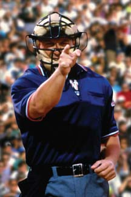

I was talking with Shawn, a friend of mine, about sports on Sunday. We were watching the Cubs game on ESPN, and commenting on various things throughout the game. For some reason, we started talking about rules (like how I'm not a huge fan of the infield fly rule, or how catchers can't use their masks to move the baseball, etc.), and Shawn brought up an interesting comment. His idea was to replace umps calling balls and strikes with a computer that did it for you.

Hrm.

On the outside, that seems like a swell idea... as he put it, "If a human gets it 95% correct, and a computer could get it 96% right, shouldn't we make it better and get rid of the umps?" (slight paraphrasing)  And it's a very legit point.  How many times have you seen a call on the outside corner be there on strikes 1 and 2, but when the exact same spot is hit for strike 3, the zone has magically shrinked?  Or one team's pitcher will be a 15 year vet and get the "reputation" calls, while the rookie on the visiting team will get a tiny little strike zone?  \*OR\*, an even more prominant example was Jonathan Sanchez's no hitter this past week, with an absolutely disgusting and filthy curveball thrown to the outside part of the plate for the final strike.  Let's be honest.  It was outside.  By a lot.  I think the umpire gave him the call as a sort of "mercy" call, to let him get out of the game before anyone got a hit off of him.

Any of these situations could be easily rectified by a computer.  We've already got the technology in place with K-Zone... I'm presuming whatever they need for it has been installed in every park, since we always see the analysis of the pitches on games that are on ESPN.  It's also being used currently as a way to train umpires so that they do better.

Buuuuuut... I don't know.  I have no issues (normally) with technology in all parts of society.  If it makes it better, I'm all for it.  However, there's just something about the tradition of baseball that leads me to believe an electronic balls/strikes umpire wouldn't be very popular.  Things like boundary calls (out of bounds in NFL, line calls in tennis) or time-related issues (buzzer-beaters in basketball), yeah, I'm totally down with.  But the thing with those is, the lines or clock are fixed, and they're not gonna change at all.  The strikezone?  It changes from player to player.

Think for a minute.  What do you definte the strike zone as?  We obviously know that the plate determines the side boundaries.  What about top and bottom?

\*Jeopardy music\*

Here we go... the top of the strike zone is "a horizontal line at the midpoint between the top of the batter's shoulders and the top of the uniform pants."  The bottom is "a line at the hollow beneath the kneecap."

.... yeah.

Basically, letters on the jersey to the knees.  Fairly simple in definition.  Yet what K-Zone shows is often a little smaller than that.  Plus, umpires will be quite generous with that "hollow beneath the kneecap" thing sometimes, somehow mistaking the shadow of the Achilles' tendon for the knee.  And we won't even talk about the width of the plate... I'm often curious how exactly an umpire can judge inside/outside when he's not centered square behind the plate.

Back to my point... I'm sure a computer could eventually do a great job at calling balls and strikes.  But baseball is all about tradition and politics.  There's no rule saying you can't swing at a 3-0 pitch.  There's no rule saying you can't shout at someone as they're going for a pop fly (well, there is, but you get my drift).  There's nothing inherently wrong with throwing a ball waaaaaaaay inside on another guy who's not breaking the rules by crowding the plate.  It's all unwritten rules of the game that you learn as you grow up and play more and more ball.

Same with the strike zone.  When you're a vet, you get calls.  When you're a rookie, you get squat.  If you looked a little too hard at the umpire on a questionable call earlier, it's pretty certain that you're not getting that call later either.  If you're dominating the opponents, the zone expands a bit more.  If you're struggling, it shrinks.  If you're throwing a no hitter, you can probably throw the ball at the batter's head and get a called strike.  Certain umpires have tall strike zones, certain umps have fat zones, and some umps have strike zones the side of Rhode Island so they can make ear-splitting strike calls... I'm looking at you, Jim Joyce.

And you know what?  I'm ok with that.  It's part of baseball, and it's part of why Americans (and pirates) love baseball.  They're not really rules, they're more like guidelines.  I'll never say that I'm not a fan of technology in sports... in fact, I'm glad that they're using cameras and tech to help umpires train and get better.  They can review their game that night, figuring out what they did right and wrong, and learning from it.  But do I want to see them replaced?  Absolutely not.  Tradition is part of what makes baseball great, and I don't think I could bear to see a tradition like this broken.

Granted, immediately after this conversation, the Cubs got bummed out of 2 strike calls in the 9th inning.  Both high and outside, both called strikes, both punctuated by a "man, we should have a computer to do that".  Touche, sir... touche.
