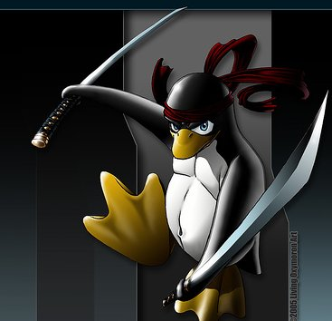

I have been utterly bested.

My opponent this evening was a sneaky foe.  They lured me out of my apartment with the smell of cooked meat.  Their flames were a beacon in the night.  Tonight, a kill was far too easy.  No, tonight, a feast was in order.  As I planned my method of attack, I took in all of my surroundings; the lights, shadows, the other targets present.  I watched them play their foolish games.  The more I studied, the more I realized that the most ideal path was straight through the center of one of these activities, next to some contraption made out of pipes.

I crept through the foliage, as silent as a cicada on a warm summer night.  I swear, if my stomach rumbled any louder, they would've heard me over their thumpity-thump machine.  I think it was trying to talk to me; I kept hearing the machine yell "get back, you don't know me like that!"  Obviously, I didn't listen.

Lying next to one of their pipe constructions, I readied myself.  I was going to have to reach right into the fire, grab the roasting meat, and disappear into the shadows.  I waited for a few moments until the time was just right... and then, I struck.  As I struck, 3 things happened:

First, a car horn bleated from behind me.  Some late comer to this festival decided to announce his presence in the loudest way possible.

Second, I rose from my prone position, reaching to snatch the tasty morsels from the fire.

Third, though most of the participants had turned to greet the new member, one continued to play his game.  This is a strange game.  They throw balls attached by string at a target, which apparently were the pipe contraptions I was near.  I'm not sure of the scoring, nor of the rewards system.  Regardless, I realized that I had neglected to take this "game" into my calculations.

Though no one witnessed it, the golf balls whistled through the air as I snatched a lone hot dog from the embers, striking me square in the temple.  I crumpled, senseless, the morsel spilling from my fingers.

A trap had been sprung.

And yet, it's almost as if they didn't realize they had caught me.  Everyone was clustered around this new fancy automobile (a Geo Metro, I think they call it), not paying any attention to the animals charring away on the fire.  It took me a few moments, but I gathered my wits about me, rising from my position.  As tempting as the food appeared, I knew my luck had faded.  Spitting in the direction of my foes, I slunk away into the night, stopping to steal a bean bag along the way.

After all... I'm a ninja, right?

Tomorrow, I will make those fools quake in their boots.  I will strike without mercy, vanquish without a second thought.  They will bow before me, and I will acquire all of their provisions (including the King-sized Snickers I saw on their kitchen counter).  All tomorrow... right after this ninja gets some Ibuprofin in his system and takes his Marketing test.
