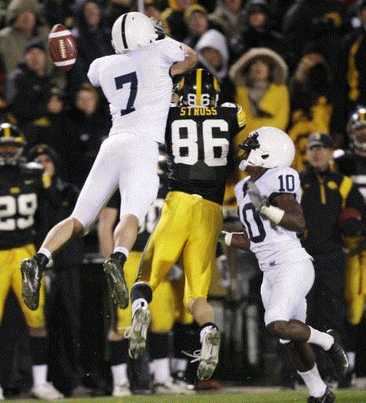

I'm a huge advocate for rules standardization between NCAA and NFL football, to some degree.  I like how the clock stops on a first down in college, and I think it's appropriate at the professional level that it keeps moving.  I \*HATE\* the NFL overtime rules.  I can't even begin to express how retarded those are.  I like the NFL playoffs (could you imagine if the NFL put some sort of crappy BCS ranking into their playoffs?  So dumb.)

The one thing I can't stand, though, is the pass interference rules in the NCAA.  For the most part, the rules are pretty similar... here's what Wikipedia has on the rules.

_In American and Canadian gridiron football, pass interference (PI) is a penalty that occurs when a player interferes with an eligible receiver's ability to make a fair attempt to catch a forward pass. Pass interference may include tripping, pushing, pulling, or cutting in front of the receiver or pulling on the receiver's arms. It does not include catching or batting the ball before it reaches the receiver. Once the ball touches any defensive player or eligible offensive receiver the above rules no longer apply and the defender may tackle the receiver or attempt to prevent him from gaining control of the ball._

_Once a forward pass is in the air it is a loose ball and thus any eligible receiver – all defensive players are eligible receivers – may try to catch it. When a defensive player catches a forward pass it is an interception and his team gains possession of the ball. Some actions that are defined as pass interference may be overlooked if the defender is attempting to catch or bat the ball rather than focusing on the receiver._

_The intended receiver may find himself a defender if a defensive player has a better chance to catch a forward pass. If an offensive player commits pass interference against a defensive player attempting to intercept a forward pass it is offensive pass interference._

_In college and pros the defender may make contact with receiver within the first five yards of the line of scrimmage. Anything after that is penalized as illegal contact. Pass interference is called if the defensive player contacts the offensive player while he is trying to catch the pass. Inadvertent contact, though, is not penalized._

_In the National Football League and the Canadian Football League the penalty for defensive pass interference is an automatic first down at the spot of the foul. If the foul occurs in the end zone, the ball will be placed at the one-yard line. In college and high school football, the penalty is to the spot of the foul, up to a maximum of 15 yards from the previous spot and an automatic first down, unless the foul occurs in the end zone, in which case the ball is placed at the 2. In the NFL, the penalty for an offensive pass interference is 10 yards and a loss of down._

I have 1 major and 1 minor issue with these rules.  The major issue: faceguarding.

I'm watching the Ole Miss/South Carolina game on ESPN right now.  South Carolina threw the ball towards the front left corner of the end zone.  The receiver had a step on his man, but the ball was slightly underthrown, so he slowed down to try and catch the ball.  The defender, rather than turning around and trying to play the ball, got in the receiver's face, made contact, and put his hands up.  There wasn't a single moment since the ball left the QB's hands that he looked back.

Now, in the NFL, that would be pass interference.  In college?  Incomplete pass.

I'm sorry, but that's just really stupid in my eyes.  If the defender is going to... um... defend, he should play the ball, not the receiver.  Had he made no contact, I can understand why he played that way.  You can try and read your receiver's eyes and hands, and block it.  But when you're up in someone's body, it reminds me of trying to get a rebound in basketball.  You're boxing out with the intent of going up and getting the ball.

And really, it's not fair to the offense.  "Oh hey, I got beat by my man, I'm trying to play catchup, so I'll kinda bump your guy and put a hand up, and hopefully make you look dumb." vs. "Oh hey, I got beat by my man, I'm trying to play catchup, oh crap, I don't know where the ball is, I'm so getting burned."

Along those same lines, the minor qualm I have is the yardage given to pass interference calls.  NCAA is 15 yards.  NFL is a spot foul.  Drew Brees throws a bomb to a receiver and you interfere?  They get the ball where the flag was thrown.  Colt McCoy throws a bomb to a receiver and you interfere?  15 yards from the line of scrimmage, auto-first down.  That's just added incentive for the beat corner/safety to interfere and prevent the big catch/TD.  60 yards or 7 points, vs a 15 yard penalty?  That's a no brainer.

I guess while I'm on the topic of football rules, I'll put in my 2 cents regarding overtime.  I like the college rules (each team gets a possession, starting on the 25)... they're acceptable.  NFL is a coin flip for possession, and then the first person to score wins.  It would be interesting if the NFL adopted the NCAA rules (maybe go from the 35 or something), or you could just keep the exact rules you have now, and just add the tweak that each team requires at least 1 possession of the football.  There's nothing that I hate more than to see a team get the kickoff, do a 6 minute march down the field, just to kick a field goal and win the game.  I feel that you should have the chance to utilize both sides of the ball when it comes to overtimes.  Some agree with me, some don't... feel free to voice your opinions.
