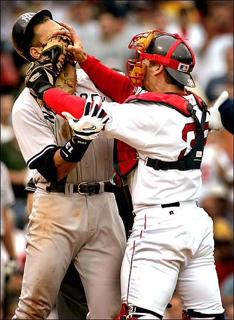

Dear Jason Varitek,

It is with great sorrow that I have to write this letter to you.  You have been one of my favorite players since the day I started paying attention to the Boston Red Sox, and knowing that you've been my team's captain for all these years is one of the most reassuring feelings there is.

But our time together, dear Jason, is coming to a close.

You see, we've got a couple of major issues going on right now.  First, there's your lack of numbers in the past couple of seasons.  Let's face it, you haven't been yourself since you had knee surgery back in 2006.  Yes, 2007 was pretty good to you, giving you the honor of catching your 4th no-hitter and your 2nd World Series ring.  But these past two year have been... how do I say it... abysmal.  Going into tonight's game against the Yankees, you've been hitting .210, with a .318 on-base percentage.  Even more horrific, you've been stolen on 100 times.  One hundred.  All of last season, you had put in nearly 150 extra innings, and only been stolen on 56 times.  And as I watch, I've seen Jeter and A-Fraud steal a base each in the first inning of the game tonight.

I'll be honest... your hitting numbers aren't terrible, for the most part.  Fewer strikeouts this season (86, as opposed to 122 each the last 2 seasons).  A pretty average amount of home runs (14... career high was 25 in '03).  23 doubles... pretty good for a big man (you had 39 in your 2nd full season, for comparison).  53 walks... you've still got your good eye.

But it's the averages that frustrate the hell out of me.  The previous stated .210 batting average, or the .318 OBP.  You've only got about 350 at bats too, which means somewhere along the line, you \*really\* screwed up.  Only 74 hits currently, a far cry from your days of 120-130 back in '02-'05.  Only 51 RBIs... below average for you, though you have a chance to get that up here in the remaining weeks.  Only 139 total bases, compared to your days of having 180-200.

Look, we got spoiled by you.  You were arguably the best defensive catcher in baseball for a good stretch of time, and you had the hitting prowess that made you fit right in as a 6/7 hitter in our lineup.  And now, you're slumping in both categories.  It may be age (37 is "old" by many baseball standards), it may be your injuries... who knows.

(For the record... Cano just stole on you too, making 3 steals on the night thus far.)

And now, to make things even worse for you, we've got Victor Martinez, arguably one of the best catchers in the game right now.  He's hitting incredibly well, he's an outstanding defensive player at both first and behind the plate, and I feel that he's just gotten better since he was traded to us.  Is Vic the same kind of intelligent mind that our pitchers are used to throwing to behind the plate?  Probably not.  Does he study and prepare as hard and as well as you do?  Probably not.  Is he going to replace you in the coming years... maybe even next year?  Probably.

I mean, hell... Martinez can catch Wakefield's knuckleball... that's pretty much game over for you.

So what I propose, dearest captain, is this... teach Martinez the ropes.  You've got a $5m team option, or a $3m player option for next season.  Take it, make your money, be a part time catcher, and work with Vic on going from "one of the best" catchers to being "the best" catcher in baseball.

No one is ever going to be able to replace you or what you've done for us.  No one on our team right now will probably ever put their mitt into A-Fraud's face like you did (for the record... I nearly lost my voice, I was yelling/laughing so hard).  (And actually, I take that back... Youk's got a bit of a temper sometimes...)  You'll get in for free to any game at Fenway for the rest of your life, you'll have your number retired, and maybe you'll even be asked to be a coach or manager someday, who knows.

But your legacy isn't over yet.  We know what you can do in terms of playing.  Now show us what you can do in terms of teaching.  Show that you're a real Red Sox player.  Help us out, not only for this season, but for the foreseeable future as well.

Who knows... maybe Vic will end off making an impression in your image with a swipe tag to Fraudriguez's grill.

We can only hope.
