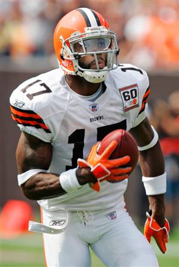

Nope, we aren't talking about Twitter or anything like that.  Instead, we are talking about what has occurred today in the NFL.

First, we start with the signing of Michael Crabtree.

You're an idiot.

I realize you've got your future to look at, and you'll probably make more money in 1 year than I will in my entire working career.  I realize you felt insulted when the 49ers offered you the initial deal, feeling that you were "worth much more than that".  As badly as you wanted to play, you were willing to sit out the entire 2009 season and re-enter the draft in order to get more money.  Yet you forgot a few key things.  First, your coach is Mike Singletary, who has proven that he's not a guy to put up with any crap from anyone (see: sending Vernon Davis to the locker room early last season).  Second, you had foot surgery.  Yeah, forgot about that one, didn't you?  I don't care who you are, no one is 100% after a surgery.  You may feel "great", but there's always the thoughts of what if that creep into your brain, as well as the occasional physical discomfort.  And lastly... well, you were picked 10th, and thus shouldn't get more money than the people in front of you.  You're nothing special.  That's how the draft and subsequent signings work.

Some quotes from the signing today:

_**Crabtree: "It's a lot of relief off my shoulders."**_ - First, I can't believe ESPN posted this one, because of the absolute stupidity of this statement.  "I feel a lot of relief" or "That's a huge weight off my shoulders" would have been appropriate.  If you have relief on your shoulders, you'd think that would be a good thing... right?

_**Crabtree: "Everybody came to a reachable agreement and it happened.  I'm just glad I'm past that part. I'm very humble right now, man, it's a very humbling experience. Just getting a chance to sit back and better myself as a person, as a player, as a teammate. ... I feel like going through that it made me look at the world in a different way, look at my teammates a different way. Hopefully it will work out for the best."**_ - You're not humble.  You just showed up after 4 games, preseason, and training camp, and you're getting paid like royalty.  If you wanted to better yourself as a player and teammate, you would've gotten there early, and if you wanted to better yourself as a person, you would've shut your mouth and taken the not-so-insane money to play a FREAKIN' GAME.  You now can view the world as one that will bend to your every whim, and your teammates are going to hate your guts for a while.

According to sources, Crabtree's contract is for six years and $32 million that could maximize to $40 million if he achieves every incentive in the deal. The guarantee in the contract is $17 million, but he is expected to make $19 million over the first three years and $23 million over the first four years. The five-year deal is worth $28 million.  This is all after he and his agent balked at the 5 year, $20 million deal with $16 million guaranteed.  I guess the presence of MC Hammer managed to sway things in Crabtree's favor.

I feel really bad admitting this, but I truly hope Crabtree fizzles as an NFL player.  It would serve him right.

Next, we'll go to the trade of Braylon Edwards from the Browns to the Jets.

My original thoughts on this matter have changed over the course of writing this post.  Honestly, I'm not really sure how to take all of this.  I really want to call this guy an idiot as well, and I think I just might.  Obviously, Eric the Genius Mangini is cutting ties with yet another problematic player, the first being Kellen Winslow II back in February.

There isn't much doubt that Edwards is a fairly decent wide receiver.  And who knows, maybe this change of scenery will do him a lot of good.  But if the alleged punch of LeBron James' friend is true, the Jets may find themselves in a tight spot.  I really don't know what Rex Ryan and the Jets organization is thinking lately.  Obviously they want a high-caliber wide receiver to pair with what they believe is the future of their franchise in Mark Sanchez.  But who have they gone after?  Brandon Marshall and Plaxico Burress.

Oops.

Edwards was out partying and drinking with Donte' Stallworth the night of Donte's car accident, in which he struck and killed a man.  He often neglected Mangini's offseason programs, and even missed part of camp this year due to an injured ankle sustained while playing basketball.

Braylon... get your head on straight, man.  Play some football.  Be successful.  Don't Do Dumb Things (D^3 T rule).  You
