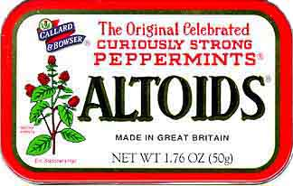

I was trying to think of a title for this post, and couldn't really think of something that fit.  So I came up with a random tidbit.  Read below if you're curious.

School is back in session, and 1 week is down.  It's a definite shock compared to last semester.  I'll be honest, last semester was a joke... 2 business classes (Macro Economics and Intro to Information Systems, both of which I enjoyed, and one of which I was done with weeks ahead of schedule) and 3 gen eds (Humanities 1, Physics, and Personal Wellness) was my way of easing back into the school lifestyle, as opposed to working life.  Or sitting at home doing nothing life.  Regardless, it was designed (by me) to be easy and help me get reacquainted with my long lost (or never discovered) study habits.  I happily pulled off an A, a B+, and 3 Bs.  Easily my best semester at UNI.  Now, however, I'm taking 4 business classes (Micro Economics, Intro to Business Programming, Business Statistics, and Financial Accounting) and 1 gen ed (Philosophy... retaking because the department head was a horrible professor and I want to improve my GPA).  Micro, I should be OK in.  Business Programming will be interesting, fun, and (hopefully) easy.  Philosophy (just reminded myself to do homework, actually...) is just going to be a little out of class work, combined with paying attention to his lectures.  Business Stats and Financial Accounting, however, are going to be a bear.  Busy work up the wazoo.  Blech.  Thankfully, my friend Zeke is in both of those classes with me, so that should make it more bearable, as well as giving me someone to study with.

The other downfall is that after those classes are completed, I have 4 semesters to get through 15 business classes and 2 gen eds (another humanities and a capstone).  Fall '10 is going to be chock full of 5 business classes.  Ugh.  I can do this... I can do this... I can do this...

I've been in a really down mood here towards the end of this week.  Not really sure why... I don't think there's one specific thing that I can point at that's putting me into this mood.  I've been unmotivated to wake up in the mornings, resulting in only one day of working out instead of the 3 that I would've liked to get in.  I signed up to give plasma to help finance some of my projects that I would like to accomplish... however, I apparently have "small veins" (more literal translation: I'm a tough stick), so my extra $50 a week is out the window.  A couple situations in my life worked out in some not-so-ideal ways.  All the homework that I have to do is just busy work, making it that much less appealing.

I think another deal is the fact that my birthday is less than a month away.  This should be a happy time, and I'm sure it will be.  But of course, I seem to always think about the negatives of things... Here I am, just about to turn 23.  Most people my age have graduated and are off in the working world.  If I had stuck with my initial major of Music Education (and not gotten injured, of course), I would've just finished my student teaching and would hopefully have a job teaching kids how to toot their own horns, so to speak.  Even my Computer Science degree would've been nearly complete.  I know, I know, I whine about this a lot, but it's something that irks me a little bit.  I'm nearly 1/3 of the way through my life (less if I'm lucky), and I truly don't have anything to show for it... rawr cakes.  Anyway... 23 years old.  The first birthday where you don't have anything "special" to celebrate.  16, you can drive.  18, you can buy cigarettes/porn (woo?) and vote.  21, you can legally be an alcoholic.  Even 22 seems like a sort of milestone, since you're just one year removed from the drinking age.  At 23, you really have nothing special to celebrate... thus why I feel 23 is the first real age that one could call themselves "old".  That's my take on it, at least.

I'm listening to some live trance/house/techno music via [AH.FM's radio broadcast](http://forum.ah.fm/) (available through iTunes), and they currently have a chick singing "Lovesong", a song originally done by The Cure, and later remade by Anberlin.  Interesting tidbit of my evening that I thought I'd share with you.  (Oh, and to be not-cynical... it was good!)

Today, I played the absolute worst guitar solo ever.  No joke.  It was the 2nd song we played this morning at church, called ["You Are Good" by Lincoln Brewster](http://www.youtube.com/watch?v=vVn8IGUfnPA).  For those interested, the part I butchered is around 3:01 into the song.  I wasn't trying to play his solo (I didn't really feel like learning it again, since we dropped the song 3 steps), just kinda whatever came to my head.  Instead... well, I can't even tell you what I played, other than a big pile of poop.  Yes, poop.  Don't judge me.  Anyway, my playing this morning was uninspired, bland, and probably some of the worst that I've ever done since I've gotten beyond the point of playing "Yellow Submarine" over and over and over (thanks for nothing, Bob Dunn).

Oh, the Altoids story... ok.  I hate Altoids.  You know, the Curiously Strong Mints(tm).  There's nothing wrong with them, per se.  However, I have this nasty habit of chewing mints/candy/things of similar nature.  Normally, this just ends off causing said treat to dissolve faster.  However, with Altoids, they apparently cause me to sneeze.  Hard.  Not sure why, but for whatever reason, I can't resist the temptation to chew on them after they've dissolved to a certain point.  I guess a more appropriate title would've been "I'm a Glutton for Punishment" or "I'm Cranky"... those fit the story and the post better, I think.  Oh well.
