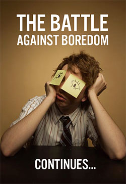

Lately I've been feeling... I think lethargic is the proper term.  Lazy.  Bored.  Tired.  Uninspired.  Any verb-age you choose to use, it probably would fit.  On Thursday, I decided to take a nap at 7pm, just because I was feeling really down.  I didn't wake up until 7:45am on Friday morning.  I had a similar occurrence Saturday night, falling asleep at 8, only to wake up at 1am and entertain myself until 7... then I went back to bed for 2 hours before going to church.  Not feeling sick, not depressed, just... bored.

I had a little bit of an epiphany today in my statistics class.  (As a quick aside... there's something to be said for having a class with some of your friends.  Some people would probably flip to know that today, I sat in the back of the class with 3 friends.  However, our statistics class utilizes a book, a notebook, and a binder, plus your calculator, and sitting in a lecture hall with all that just doesn't work.  However, there's a table in the back of the room that we commandeered, thus we were able to spread our material out and not be so cramped.  We joked around and had fun, cracked a few jokes, but this was the first stats lecture that I actually felt that I learned something in this semester.  Anyway...)  A vast majority of the class was just sitting around all lazy-like, not paying attention, not responding to questions, and so forth.  Professor Uyar made the comment that "we should never be bored in class" (I think my dad would like this prof).  He then made a statement that kinda startled me.  He said, "I have never been bored in my entire life."

Initial reaction: bullshit.

But then I thought about it.  "Back in the day" (aka before the 80s), what did people do to entertain themselves?  When they were kids, they played with simple toys, rode bikes, ran around and did mischievous things with BB guns, read books... sounds similar to my childhood (minus the BB guns... I was always a little bummed about that, but it probably saved me from getting grounded).  They didn't have ESPN, Cartoon Network, Disney, MTV, any of that.  Back in the day, TV was reserved for special occasions... Friday nights, a good movie, a special sporting event, etc.  I didn't even own a video game system until after the N64 had been out for a couple of years.  There were no such thing as "personal computers", the internet (maybe not even Al Gore... I'm not sure how old that dude is.  What year did he invent himself?), and so forth.

Now look at us.  Right now, as I sit here, I'm writing this on a computer screen that's bigger/better than my TV.  I've got Facebook running in the background, I'm blasting some Metallica (I've recently taken a liking to this band... never cared for them before.), instant messaging a few people, tweeting, and checking my RSS news feeds as they update.  I've sent a few text messages while writing just these past few paragraphs.  My TV is actually off, but that's not very common when I'm not studying.  Actually, scratch that... Manchester United and Arsenal are replaying on Comcast right now.  My PS3 is hooked up on my desk (though I actually haven't played that since last semester's finals week).  I've got a couple of guitars in my room, along with some books.  I've got the campus rec center available to me.  I've always got studying I could do, but I'm saving that for while I'm at work.  This is a pretty constant representation of my personal situation.

And yet... I get bored.  Bored, I say.  What an insane concept.

I think society as a whole suffers from this concept, especially a vast majority of my generation.  Our attention spans are so short now that we quickly lose interest in what we were doing, just because some minor thing distracts us.  I've seriously been contemplating/writing this post for nearly an hour, so this isn't just a blast on others, but towards myself as well.

I remember a quote from another professor I had last semester.  Professor Schnucker is an 87-year-old Humanities prof that is probably just as lively now as he was 20 years ago.  On the last day of class, he allowed us to ask any question we wanted.  Someone asked how often he naps, and he replied something along the lines of this... _"I never nap.  I rarely even sleep.  I usually go to bed around 12, and wake up around 4.  Even when we don't have classes, like in the summer.  I've got all your shit that I have to grade and hand back to you, but I also feel like napping just wastes time.  If I read a book, I'm entertained, and I might learn something.  If I watch a show on the History Channel, same deal.  I could go on a walk or run and get exercise.  But sleeping... there's no benefit.  That's time that you didn't benefit from, and you can never have your time back."_

I found a great quote as I was looking for an appropriate image for this post... _"Boredom is a pattern, not a reality."_ How true that is.  Even with all our gadgets and techie stuff, we still manage to settle into a daily routine with everything we do.  Some people benefit from this.  Others suffer.  I personally like to mix things up, as having the same pattern every single day would literally drive me insane.  I can't even think of what I was doing this time last week (besides getting ready to go to work), so a week-by-week schedule works out nice for me.

So my new goal now, along with my New Year's Resolutions (still haven't succumbed to fast food, though I did drink a Mt. Dew on Sunday... man, I was so wired.) is to try and alleviate as much boredom out of my life as I can.  And I think everyone would benefit from doing the same.  Go on a walk.  Exercise.  Play an instrument.  "Waste time" playing a video game.

If you're bored, **it doesn't mean you're doing something wrong... it means you're not doing something right**.  Break the pattern, conquer those lulls in your life, and engage yourself in something.  We only live once.  Let's make the most of it.
