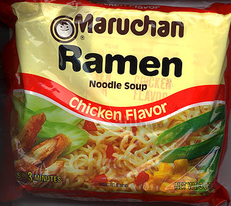

There is nothing more rewarding to a student of any level than the moment that they are able to apply their knowledge to a real world application.  This is even more true for those of us that are paying insane amounts of money for our education (can I get a "what what" from the college students out there?).  Take my Statistics class, for example... we've been discussing how to compute the probability of events based upon certain conditions.  Then we got some real-world examples of how this would be useful in day-to-day life, and how statisticians can be employed across nearly all fields in the working world.  It helped to lock in what we'd been talking about, as well as giving me that little "ahha, that's why I'm learning this" moment.  (On a side note... I find it hilarious that the first place that I met my Stats teacher was the casino over Christmas break.  He and his wife apparently frequent the buffet there, but I definitely met him at a blackjack table.  Probably a good place for a statistician to hang out on his down time... maybe I should hit the tables with him.)

So tonight, it only seemed logical that I thought about more of those "practical application" things.

I was struggling earlier trying to find a topic to write about.  Most of the stuff that I've written about in the past has been nagging thoughts on my mind.  It's quite difficult to just take a topic and run with it, especially in the case of a blog.  Anyway, I asked my friend Analise what I should write about.  Her reply?

> "Blog about Ramen noodles, and how it is the life source of many broke people of the world."
> 
> 

I shuddered.  Pretty violently.

According to my Economics classes, Ramen noodles are what's classified as an "inferior good" for most people.  For many products (known as "normal goods"), when your income level increases, you buy more.  More steak, more electronics devices, maybe more pop, stuff like that.  Increase in income = increase in demand for the good.  But with inferior goods, the opposite happens... when you make more money, you buy less of it.  Increase in income = decrease in demand for the good.  Ramen is the prime example of this, especially for college-aged students.  When we make more money, we finally decide to buy some damn spaghetti noodles, a pound of hamburger, and a jar of Prego (or some generic brand, if you so choose) and make some spaghetti.

Ramen and I have a pretty interesting relationship.  I go through periods where I absolutely love the stuff.  I can still remember the first time I ate Ramen... I was in Montana with my dad and some members of my Boy Scout troop, on a backpacking/whitewater rafting trip through Glacier National Park.  We were sitting at our base camp, making dinner our first night after we'd gotten off the trails.  2 pouches of chicken-flavored Ramen (not just the best kind, the \*only\* kind), 4 cut-up hot dogs tossed in, and 3 minutes later, BAM, you've got dinner.  Some days, it really just hits the spot.  Most days now though... well, I've been a broke college student long enough, and I'm not living in the wilderness, equipped only with a butane burner to cook on.  I'm pretty sure this is a common sentiment among a vast majority of the people my age.

I really wish I lived in China or Japan, man.  Looking up "ramen" on Wikipedia [yielded some pretty delicious looking photographs](http://en.wikipedia.org/wiki/Ramen).  Heck, even looking at the package picture above looks delicious.  But I guarantee that takes far longer than 5 minutes to prepare.  Again, America as a whole ruins the good things for the rest of us.  We want something good, fast, and cheap... but sadly, we can only have 2 of those 3 options.  We can buy in those blocks, or now we can even buy pre-packaged styrofoam cups (with vegetables!), so it's even portable for us now.  But it's so unhealthy... crazy amounts of sodium in those packets.  No wonder college kids get fat.  It's not the beer after all!

I'm trying to think of other examples that would fit this "inferior good" schtuff for college students.  PB&Js are delicious regardless of age, and Kool-Aid is the bomb.  I guess if I never had to eat a Hot Pocket again in my life, I wouldn't lose too much sleep.

Damnit, Analise... now I'm hungry.
