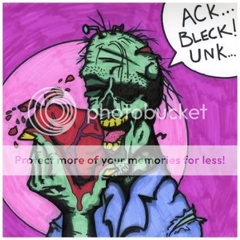

My birthday is here.  I'm getting more and more excited as the week goes by.  I'm slowly getting over my "holy crap, I'm getting old" phase and coming to grips with the fact that there's nothing I can do about it.  30 is the new 20, right? (or is that only for females???) I get to enjoy some Hu Hot and gifts with my parents on Friday (the night before), go to Peoria, IL on Saturday to watch the Northern Iowa basketball team (#18 in the country... sweet!), and then come back and celebrate my birthday with my birthday-sharing-friend Kat and others.  It should be a pretty good time, all in all.

On the other hand... Valentine's Day is also approaching.  The day after my birthday, in fact.  What a wonderful holiday for a single guy to celebrate.  This will be year #3 that I shall be "celebrating" by myself (get your mind out of the gutter, you perverts).

I had a talk with a Kat today about my singleness.  She laughed outrageously [at my post about the girl in the computer lab](http://niclake13.wordpress.com/2010/02/08/whoops/).  Just like everyone else, though, she tried to reassure me with the "aww, you'll find someone" talks (many of which were absolutely hilarious statements, but every one of them spot on).  Through it all, I discovered a couple of things...

I'm doing almost everything "right".  I'll admit, I'm not the most attractive guy in the world.  I've put on a few pounds since I was with my last girlfriend, I'm short, etc. etc.  So I have to make up for these things in other ways.  The ones Kat pointed out were "Talk to girls, be chivalrous, and be nice."  I'm one of the nicest guys around... really, I am.  Obviously I have a mischievous, dark side that can turn really ugly if you piss me off or something (I'm sure everyone does), but that doesn't stop me from being nice to you until you give me a reason not to.

"Innocent until proven douchebag"... or something like that.

Chivalry is also something I'm very good at (kinda goes with being nice).  I'll hold the door open for anyone, guy or girl, if they're heading my way.  When I'm actually dating a girl, she's #1 in my book, and I always treat her as such.  There are many people saying "chivalry is dead", but I don't think so.  Even the strongest, most independent woman that bitches at you that she "doesn't need your help" will look back at some of the things a good partner did for them and appreciate them, especially when/if they're gone.  (And ladies... seriously.  Guys will never admit this, but those little things you do?  We love them.  Seriously.  And the "real" ones among us could care less if those things you do happen around our guy friends.  We're not whipped... we're happy.)

However, talking to ladies is not my forté.  Obviously we have the case of me and the girl in the lab, but truly, she struck up the conversation at first.  I'm this for many reasons...

1. I'm intimidated by attractive women.  Most guys are.  Men have extremely fragile egos, and we counter that by working out until we look like The Situation from "Jersey Shore", being loud and boisterous with our bros at the bar (also like The Situation) as a show of confidence, or avoiding the hell out of you.  The girlfriends that I've had?  They've all been ones that I've known for a long time (3+ years) in some regard, and/or friends of mutual friends that semi-hooked us up.  This is fine with me, since my friends usually know what it is I'm looking for, but it's still frustrating that I can'd do this myself.
2. I have no idea what to say, and I'm afraid of the conversation crashing to a halt faster than it began.  I can handle a "no", "not interested", "I'm a lesbian", whatever.  That's not the issue at all.  I just don't know how to strike up a conversation out of the blue without making you (ladies) feel like I'm creepin' on you.  How do I open?  "Stupid Saints!"? (this one kinda worked... kinda)  "Wow, this weather sucks..."?  "I think you're beautiful..."?  "Hey baby.  Sup?"?  Really, I got nothing.

Oh, and going off of the "I'm short" part... Any guy that's over 6 foot tall?  Do us short guys a favor.  STOP GOING AFTER WOMEN THAT ARE 5'5" OR SHORTER, PLEASE!!!  Seriously... you have a whole spectrum of ladies that make me look even shorter than normal.  Pick one of them, and leave some of the women that help me feel good about my height available.  K?  K.

I don't hate Valentine's Day.  Believe me, even though it's just a commercialized holiday meant to make flower stores and Russell Stover a boatload of money, I feel happy for any of my friends that get to celebrate this holiday.  I, however, don't... so you can all kinda go screw yourselves. :-)  Until either A) Valentine's Day is a national holiday (meaning we get the day off of school) or B) I find myself a nice girl, I'm not going to be enjoying this day.

I've watched a lot of my friends find boy/girlfriends that they adore, get engaged/married, and some of them even having their first child.  I'm so happy for all of them, and I wish them the best.  (Gosh, I feel like a woman sometimes, but...) I guess I'm just jealous of them, that they've found that person that makes them happy.

And as far as the title?  Well... the way I see it, zombies would be more than willing to share their heart with you.  Awwwwwwwwwwwwwwwwww... how sweet!

