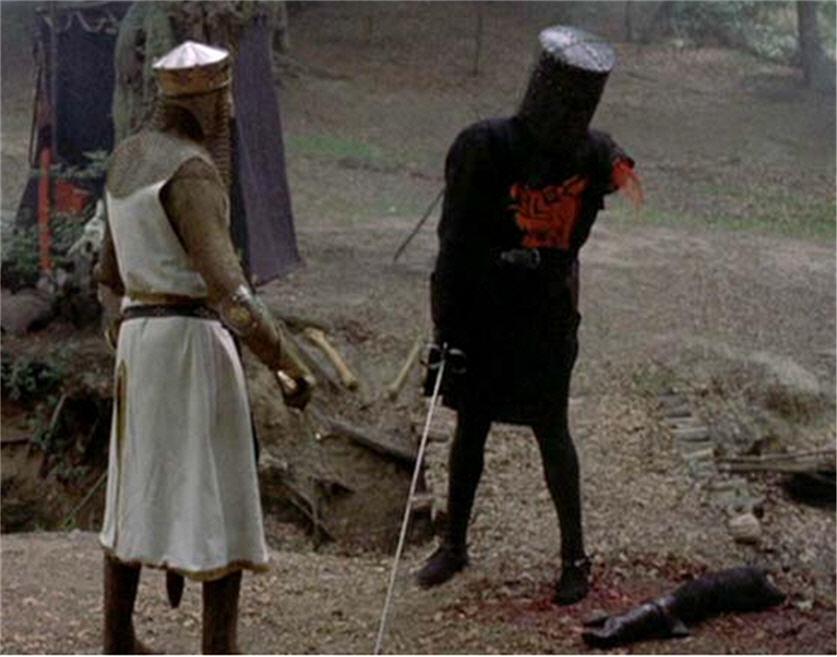

Think about your deepest fear.

Really think.

Maybe you're like me, and think that your deepest fear has to do with trusting people.  Or perhaps, you've got a massive case of stage fright.  Or maybe you just happen to be afraid of a little snow blower, like this fellow here to the right.

Now really examine it.  Look really hard at what it is that you're so afraid of.  You know what it is you're scared of?

**_Failure._**

My fear of trust?  Fear of failing with people, or being let down.  Stage fright?  You're afraid of messing up while performing for people.  That guy over there?  Well, he's already failed to grow feet, so that pretty much covers his end of the bargain, methinks.

Everything that we as humans don't do, everything that we fear so much, always boils down to us not wanting to fail.  Failure to perform, failure to maintain to control... hell, even failure to stay alive (which is why I don't bungee jump, or haven't yet).  Some fears have very minor, very brief consequences.  Others obviously can have long lasting effects on our lives, and the lives of others.

But why are we so afraid? What if we, as a human race, actually decided to man (or woman) up and overcome our fears?  It really isn't too terribly difficult, most of the time. A little persuasion from friends, a little help from those we know and trust, and we can take those crappy little thoughts and quash them like bugs.  I even went out on a limb this past week, working towards alleviating some of my own fears.  Have they been conquered?  Probably not.  Have they been met with success?  I have no clue yet. But I tried.  That alone counts for something.

I'm not saying not to live with fear.  Fear makes us question things, prevents us from doing insanely stupid things just because we think we can.  As cool as it would be to be able to flap my arms and fly, I fear for my safety if I try jumping off the Business Building and giving it a whirl.

No, instead, I do feel that the general concept of fear is good for us, in general.  It keeps us oriented on the tasks at hand, and prevents us from straying too far from the paths placed in front of us.  But by the same token, when we allow those fears to cripple us, to be irrational and make us incapable of action... when that fear CONSUMES us... well, that's when things become an issue.  I imagine that if fear didn't exist, we might have a lot fewer people on this planet.  But by the same token, I think that there would be a lot more advancements in technology, in the arts, in science, in every aspect of our culture today.

You will never, ever hear me say that you shouldn't fear things.  Death on this living world, injury, embarrassment, these are all very real, and all very possible depending on the routes we take.  Fear keeps us grounded and gives us focus.  No, instead, the terms "don't sweat the small stuff", "it's just a flesh wound" and (more recently) "man up!" come to mind.  Please, don't go dying on us, but don't be afraid to step out on a limb for something you feel strongly about, or that you believe in.

I leave you with 2 quotes.  One is from the movie Serenity, which I just finished watching.  The quote goes "It doesn't matter what you believe.  Just believe it."  The second is far too long to fit in my own paragraph, so I shall give it its own down below.

Fear of failure must never be a reason not to try something.

> Our deepest fear is not that we are inadequate. Our deepest fear is that we are powerful beyond measure. It is our light, not our darkness that most frightens us. We ask ourselves, Who am I to be brilliant, gorgeous, talented, fabulous? Actually, who are you _not_ to be? You are a child of God. Your playing small does not serve the world. There is nothing enlightened about shrinking so that other people won't feel insecure around you. We are all meant to shine, as children do. We were born to make manifest the glory of God that is within us. It's not just in some of us; it's in everyone. And as we let our own light shine, we unconsciously give other people permission to do the same. As we are liberated from our own fear, our presence automatically liberates others.
> 
> \-- Marianne Williamson
