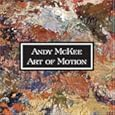
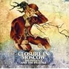
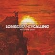
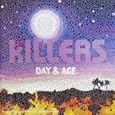
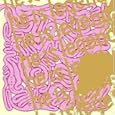
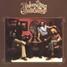
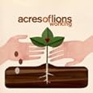
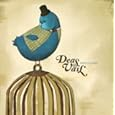

Alright, so I think it's time to start a trend among myself and my fellow bloggers (especially the group over at 20 Something Bloggers).  So here it is...

**Music Mix-Up Monday**

Yeah, the name's a little cheesy, but it gets the point across, I think.  I'm thinking every other Monday, I will be posting a little post about my favorite 10 songs over the past 2 weeks, as well as providing a link for you to download the songs for your own listening pleasure.  Why every 2 weeks?  Well, trying to do this every week would mean that I'd run out of variety that much sooner.  And I definitely don't want that.

First and foremost... for myself, as well as anyone else doing these posts, remember that everyone's musical tastes are very, very different.  Be open-minded when you listen to the music.  Don't dismiss things just because it's not your "normal" musical style.

So here goes... the first week of Music Mix-Up Mondays!

**[Download this mix from Mediafire.](http://www.mediafire.com/?t5z2jkjwdxd)**

**1. Keane - Spiralling (off the album _Perfect Symmetry_) - Alternative/Piano Rock** The opening track off of the album, it starts off kinda weird, but once it gets going, it really kicks in.  I love Keane... they manage to rock pretty hard for being on pianos/keyboards primarily.  Any of their albums are great listens, and I'm sure they'll be making return trips into these lists.

**2. Andy McKee - For My Father (off the album _Art of Motion_) - Acoustic/Instrumental** I was introduced to Andy a long time ago, but never took the time to listen to his albums.  Now that I have... well, I'm disappointed that I haven't done this sooner.  This is probably my favorite song off of this album.

**3. Closure in Moscow - Here's to Entropy (off the album _The Penance and the Patience_) - Progressive Rock/Metal** Closure in Moscow is a band I discovered a few months back.  These guys are definitely right up my alley for musical style... now if only I could write the kind of stuff that they do.  I honestly think that their 6-song EP is better than their debut album, which is why I'm including a song from there in this list.

**4. Long Distance Calling - Black Paper Planes (off the album _Avoid The Light_) - Post-Rock** I've been on an instrumental/ambient kick this school year... I love having music playing while I study/sleep/work/whatever, but sometimes having lyrics can detract from the things I'm trying to accomplish.  Long Distance Calling is definitely the heaviest/hardest of what I currently have, and works great as workout/videogame music.  This is my favorite song of theirs.

**5. The Killers - Human** **(off the album** _**Day and Age**_**) - Alternative Rock** The Killers and I used to have an on again/off again relationship.  Not anymore.  The Killers are an excellent band... anyone who's played Guitar Hero before has probably run across them once or twice.  I love this song just because it's so smooth and stuff... this whole album just takes you on a really nice trip (not of the drug kind... yeesh).

**6. He Is Legend - China White (off the album** _**I Am Hollywood**_**) - Hard Rock/Screamo** I Am Hollywood is literally one of my favorite albums I've ever listened to.  Ever.  Across all genres of music.  The entire album is put together flawlessly, and seems to flow from one song to the next.  The end of the album is where it gets really good, though.  You'll probably see this album repeated in the MMMs a couple of times.

**7. The Doobie Brothers - Rockin' Down the Highway** **(off the album** _**Toulouse Street**_**) - Classic Rock** The Doobie Brothers are always great to listen to... totally classic.  I heard a cover band playing all kinds of oldies on Saturday night, and the Doobie Brothers popped into my head instantly.  So I listened to a lot of their music on Sunday, and this is my favorite of the bunch.

**8. Acres of Lions - Fine Examples** **(off the album** _**Working**_**) - Indie Rock** I actually discovered these guys today, when I woke up from my "I feel like crap" nap.  I woke up, heard this album playing, and got out of bed so I could restart the whole thing over again.  This is actually one of 3 different tracks that I considered putting in the list.  You may see some of those make their way in somewhere down the road.

**9. Deas Vail - Cages** **(off the album** _**Birds and Cages**_**) - Indie Rock** Deas Vail is a great, mellow band that has really influenced my guitar playing as of late.  Soaring vocals, great melodic/harmonic lines, and excellent lyrics make this band one of my favorites to listen to.  "Birds and Cages" is their newest album that just came out, and this is one of my favorites from that album.

**10. Sara Bareilles - Gravity (off the album** _**Little Voices**_**) - Pop/Piano Rock** Always been a big fan of Sara.  She's the female, piano-playing version of John Mayer in my mind.  I'm really hoping that she releases a new album soon.  This has always been my favorite song that she's done, and is a great way to close out the record.

**[Download this mix from Mediafire.](http://www.mediafire.com/?t5z2jkjwdxd)**

I hope you all enjoy the music, and I hope to see you making your own mixes here soon!
