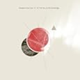
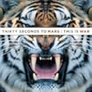
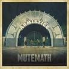
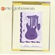

Hello everyone, and welcome to the 2nd Music Mix-Up Monday.  It seems that a good number of people enjoyed [the first iteration of this](http://niclake13.wordpress.com/2010/03/01/music-mix-up-monday-march-1/), so we're gonna give it another try.

First and foremost... for myself, as well as anyone else doing these posts, remember that everyone's musical tastes are very, very different.  Be open-minded when you listen to the music.  Don't dismiss things just because it's not your "normal" musical style.

So here goes... the first week of Music Mix-Up Mondays!

[Download this mix](http://www.mediafire.com/?mkjmmtmkytm)!!!!!

 **1. Number One Gun - The Victory (off the album _To The Secrets And Knowledge_) - Rock** I discovered this song right after I did the first MMM 2 weeks ago, and it's been stuck in my head ever since. While being a Christian rock band, I think their music could be appreciated by a lot of people. It's actually just one guy writing a bunch of stuff and having a band tour with him, as far as I know. As a friend put it, "It's like an indie rock version of Nine Inch Nails". Pretty good compliment, I think.

**2. 30 Seconds to Mars - Kings And Queens (off the album _This Is War_) - Rock** ESPN used this song yesterday during their NCAA Championship recap video, and I found it appropriate. When I first acquired this album, this song wasn't included for some reason. When I realized that, I got angry, and then bought/downloaded it from Amazon. It's a really good song, and a really good album. It's sad to hear people bash 30STM as a "crappy emo band"... they're definitely a really good kinda-emo band.

**3. MUTEMATH - Clipping (off the album _Armistice_) - Experimental Rock**

I saw MUTEMATH with my ex when they came to Wartburg College in Waverly, IA, opening for The Fray back in 2007. Now, I didn't know any of the bands when I actually went. I'd heard of The Fray, but hadn't listened to them before. MUTEMATH absolutely blew them out of the water. Their energy, musicality, and overall performance characteristics were just outstanding. So happy I had 3rd row seats for that show. MUTEMATH continues to be one of my favorite bands to this day.

**4. Eric Johnson - Cliffs of Dover (off the album _Ah Via Musicom_) - Instrumental/Guitar** Ok, I have a confession to make. As a guitar player, I did not know of Eric Johnson until after I played Cliffs of Dover on Guitar Hero 3. I feel so ashamed... Ok, that moment's over. I'm not sure how, but I found this live video of him performing back in 1990. The first 5:27 is just a massive, awesome-sounding intro. I also have the video linked below, if you care to watch.

**5. Coldplay - Lost! (off the album _Viva la Vida or Death And All His Friends_) - Pop Rock**

Another of those "crappy pop bands" that I like to listen to. Coldplay gets stuck in your head. Thankfully, I enjoy listening to them, so I'm never too disappointed when that happens. Lost! is one of my favorite songs off of their most recent album, so here you go.

**6. Circa Survive - The Difference Between Medicine And Poison Is In The Dose (off the album _On Letting Go_) - Progressive Rock**

I love Circa Survive. They're all about breaking the mold of what modern music is and trying different things that you've never heard before. Their guitar players run simultaneous lines, which is exciting compared the the boring power chords that rock music seems to be all about lately. This entire album is fantastic, and so I just picked one of these songs at random.

**7. Secret & Whisper - Great White Whale (off the album _Great White Whale_) - Post-Hardcore**

One of those storytelling songs. Secret & Whisper is another "progressive" band, playing things outside of the box, writing obscure lyrics (capturing a whale? Uprising of the animals? Interesting...), and just generally being a great band. There's also the fact that Charles' voice is captivating... not really sure why. The band has a new album, "Teenage Fantasy", coming out at the beginning of April, so if you like them, keep a lookout for it.

**8. Weaver at the Loom - You Can't Evade Them (off the album _I Was Searching and I Found_) - Indie Rock**

Love Weaver. That's really all there is to it. They're a combination of lyrical genius and atmospheric instruments, all combined into a nice convenient package for your listening pleasure. Really sad that I haven't heard anything from this band in the past few years, hopefully they'll come out with something new soon-ish.

**9. Bloc Party - Helicoptor (off the album _Silent Alarm_) - Indie Rock**

Another band that I discovered via Guitar Hero. Seriously, I love those games, just because of their ability to introduce people to new music. Props to them for that, and boo to all those bands that feel that they're "too good" for that game. Bloc Party, while not necessarily sounding like the most polished band out there, can develop some amazing sounds and songs out of the raw grit that they play.

**10. Death Cab for Cutie - Transatlanticism (off the album _Transatlanticism_) - Indie Rock** And finally, Death Cab. This band is literally all over the map, with plenty of up-tempo songs, as well as a plethora of slow, melodic, reflective songs like Transatlanticism. If you're ever having a day that you're just feeling kinda blah about everything, Death Cab is a great band to listen to. This album, as well as "Plans", are my favorites of the bunch. Another band that will be making recurring appearances in MMM.

[Download this mix!](http://www.mediafire.com/?mkjmmtmkytm)!!!!

So... videos.  Here's the "Cliffs of Dover" video I promised.

\[youtube=http://www.youtube.com/watch?v=VnqpOFcBiMM\]

Also, if I'm talking about MUTEMATH, I can't not show this video.  Prepare to have your mind blown.

\[youtube=http://www.youtube.com/watch?v=7XVWR-5fiG0\]

I hope you all enjoy the music, and I hope to see you making your own mixes here soon!
