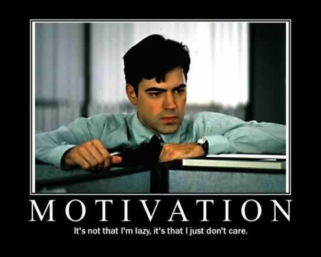

I have absolutely no idea what "working hard" means.

And that bothers me.

For as long as I can remember, I've just coasted through life, in nearly every regard.  I've never been a good student, setting with B's when I could just as easily get A's if I put a little effort in.  If I enjoy the class, I'm more apt to put in a little more effort... but by the same token, the classes I enjoy are usually the classes that I find easy.  Macro Economics comes to mind.  I loved the professor, enjoyed the class, and found the material to be an absolute cakewalk... and I got an A.  If I ever take any class related to Apple products (which I probably won't, but it'd be sweet), I'll love it since that's what I'm comfortable with.

On the other hand, I look at classes like Business Statistics and Financial Accounting, which I hate.  Professors are ok, but I'm just not very interested in the material, and thus I lose some motivation to apply myself.

But it doesn't even have to be things I don't like... I'm just so scattered in the head, that I can't focus on one thing for very long.  School, computers, video games, guitar, working out, whatever.  I.  Can't.  Stay.  Motivated.  And it sucks.

I was a 2-time state champ in piano as a kid, and undoubtably one of the best (if not the best) in my age group when I "retired" in high school.  Why?  Cause my mom kicked my ass every day and made me practice 1.5-2 hours every morning.  Every damn morning.  I hated it so much.  The only satisfaction I got out of it were immediately after the 5ish performances I had every year, cause I knew that I'd probably get the next day off.

These thoughts all started tonight when I was watching the newest season of The Ultimate Fighter.  For those that don't know, they're in their 11th season now.  It's a show about a bunch of guys that want to get into the UFC (Ultimate Fighting Championship), and have to fight their way through the season in order to earn a contract with the company.  The format now is that a bunch of guys show up the first 2 days, and they have preliminary fights to see who even makes it into the house.

One of the fights I watched had some French dude fighting against another guy.  After one round of getting knocked all around the ring, he quit, complaining "I'm tired" and "my wrist hurts" (which, strangely enough, sounds like 2 of my main excuses for things... except when my wrist hurts, I've learned not to mess with it).  One of the coaches got really ticked off, shouting "There's no quit in the UFC!"

I wish I'd hear that more often.  "There's no quit in \_\_\_\_\_\_\_!"  The first person that comments with something girly gets yelled at.  Be creative.

Then, the last fight of the night was between 2 guys that were friends off the show.  They're going along, giving it their all, and suddenly a punch lands, and the guy's nose literally caves in.  It was kinda gross.  And what does he do?  He shrugs it off, wipes the blood away, and goes after the other guy.  (Granted, the next punch to his nose took him out for good, but that's beside the point.)  That's heart.  That's determination.  That's motivation to succeed in what he does.  TUF has put in twists lately where they bring back guys that made good showings of themselves in the prelims but lost... guaranteed this guy makes it back in.

I want that kind of motivation.

I thought about it during a commercial break... not necessarily fighting or getting hit, but how long could I go through their training, even if it was dumbed down for someone just getting into the sport, before I wanted to quit?  I can't even get the motivation up to go ride a bike for 30 minutes every day and do some light lifting.  But all the training those guys do?  No way.  I wouldn't make it 2 days without wanting to wuss out.

I've been proud of myself this week.  I've managed to buckle down and do some serious studying for some upcoming tests.  Pretty sure I aced one of them on Monday... we'll see how I do on this other one on Friday.  1 hour of my day, and I went through all my notes, re-took my practice quizzes, and got a much better understanding of the material... and that was with this beautiful weather we've got going on outside.

It's not that I can't do it.  I mean, I get up the motivation to write these blog posts (or glorified journal entries that others can read, depending on how you look at it) all the time.  When I put my mind to it, I can accomplish any of my goals.  My problem, though, is keeping that motivation constant over a prolonged period of time.  After writing this post, I'll probably have a bit of motivation for the next few weeks... then it will fade, and I'll be back to square one.

My question to you is... how do I get this motivation to stick around for a prolonged period of time?  Do I just need to hire a life coach and give them a cattle prod?
