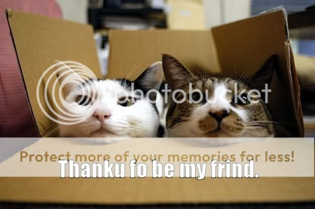

There's something to be said for pure, honest friendship.

You really don't see enough of it these days.  That really saddens me.  Cliques come and go in high school/college, Facebook has made face-to-face interaction a thing of the past, and the older we get, the more and more we lose touch with people who we consider to be our "good" friends.

When I started the school year, I had (so I thought) quite a few good friends.  At least 6 or so that I could count on for just about anything, plus those other friends that are always fun to hang out with.  I figured out real quick that most of those were just friends of convenience, mostly for them.  Quite disappointed.

The great thing about life, though, is that when one door is closed, another one (or many) seem to open before you.  For years and years, I've turned a blind eye to the vast majority of them, and they've closed behind me as I've moved on (or stayed stagnant as the world passed me by).  Now, though, I feel like a different person, taking the opportunities as they come and relishing in the joys that they bring.

Today was a dead simple day, and yet, one of the best I've had in a long, long time.

Woke up at 8.  Checked e-mail/Twitter.  Said "screw it" and went back to bed until 10.  Woke up.  Ate breakfast, showered, did laundry (oops, I think there's still some down in the dryer), cleaned up my room a bit (I just moved home for the summer), and then took off.

My friend Jordan graduated from the university today, and he had a small little get together at his house.  Jordan + his girlfriend (Jess).  Jordan's sister (Ashlinn) + her fiancé (Baber).  Jordan/Ashlinn's parents.  Jess's sister and mom.  Baber's parents and sisters.  2 other friends for a brief while.  And me.  Sitting around a fire, eating burgers/brats, drinking beer (or SoCo, in my case), and just talking.  7 hours absolutely blew by, and it was a great time.  It's all a bunch of relatives/soon-to-be relatives, and I'm included just like I'm part of the family.  That's always an awesome feeling.

Then I went over to visit Analise, a friend of mine who just got back into town.  She lives with my friends Danny and Mandy as well.  Played Scrabble.  Looked at pictures.  Talked after everyone else went to bed.  Left at 2:20.

Nothing extravagant.  Nothing expensive.  And yet, seriously, the best day that I have had since I can remember.

You gotta love days like that.

Oh, and to one of my two best friends in the world... Happy Mother's Day, Mom.  I love you, and I can't thank you enough for all that you and Dad have done for me, especially in these last few years.  :-)

\--

A few quick notes:

1) I'm attempting to grow my nails a bit.  I'm a compulsive biter, as well as one who plays with nail clippers if they're handy.  So far, I've got minuscule nails on my right hand, which are already driving me CRAZY as I try to type on this keyboard.  Rawr.

2) Frost?  On my car?  In May?  Getdafudgeouttahere!

3) If you're a musician, man (woman?) up, and listen to Owl City.  Yeah, he's crappy pop, but the layering that he does with all his instruments is insane, and truly blows my mind.  I'm listening to it right now, so you can too.

4) Major thanks again to my parents for being so supportive and allowing me a place to crash for the next 10 days, as well as on the weekends when I'm home from work. :-)

5) Due to the upcoming job, as well as me trying to be more "out there" and social and stuff, you may see a little less blogging from me in the near future.  Hopefully those of you that read won't miss me too much.  I promise to still update when I can... don't really know what the hotel situations are going to be like from day-to-day when I'm on the road.
