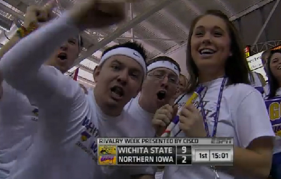

I've been attempting not to spew journal entries all over my blog as of late, but this weekend warrants it a bit.

Sunday was my 24th birthday, and the weekend in general was quite excellent.  It started during the week prior, when we had a snow day, which postponed my 2 tests on Friday to this week.  A nice bit of relaxation that made going into the weekend a bit nicer.  My parents and I went out to HuHot for dinner, and I got my presents from them: [a new guitar pedal](http://www.ehx.com/products/micro-pog) and [a wonderful t-shirt](http://www.channelshirt.com/product/13/16/Assistant-To-The-Regional-Manager-Tshirt.html).

Saturday was relatively tame.  Since I had the tests pushed back to today, I had a bit more time to study and get more acquainted with the material.  Then in the afternoon/early evening, I went to church to play guitar in the evening service.  EDIT: Holy crap, how did I forget about this?  I attended the UNI basketball game hosting Wichita State with my friends Jen and Curt (the latter of whom I hadn't seen in a few months).  We lost, but I managed to be right on camera after the first time-out.

\[caption id="attachment\_865" align="aligncenter" width="476" caption="Finally, a good quality image!"\]\[/caption\]

Sunday was an early and long day... church from 6 until 1 (thanks Bennett for the Starbucks), Pancheros for a birthday burrito (which, apparently, was on the house), Celtics basketball, a bit more studying, a trip to Buffalo Wild Wings with friends from the dorm, and then watching the Grammy's with another friend.

To some, that may seem slightly bland and relatively uneventful. But for me, that was one of the best birthdays that I've ever had.  Loved it, and wouldn't change anything that took place.  Thanks to everyone that made it happen or took part in it.
